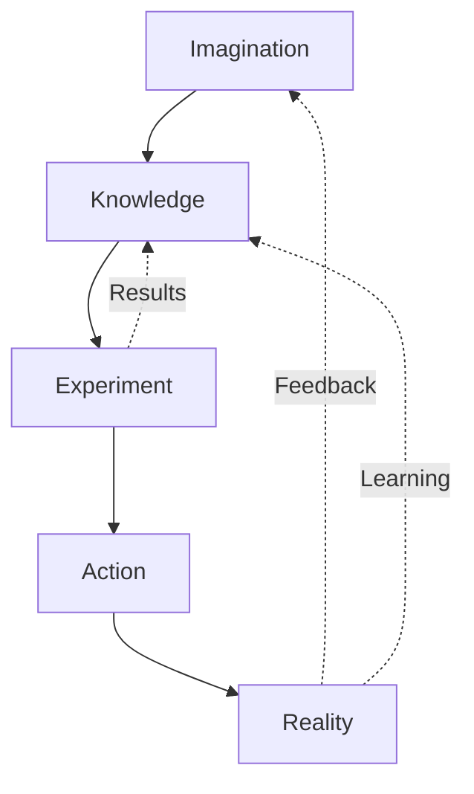

<style>
  /* === ANTONIMUS DOCUMENT THEME === */
  body { font-family: 'Georgia', 'Times New Roman', serif; line-height: 1.7; color: #1a1a1a; max-width: 900px; margin: 0 auto; padding: 20px; }
  h1, h2, h3, h4 { color: #1a237e; font-family: 'Helvetica Neue', Arial, sans-serif; }
  h1 { border-bottom: 3px solid #1a237e; padding-bottom: 12px; font-size: 2em; }
  h2 { border-left: 5px solid #3949ab; padding-left: 15px; margin-top: 40px; font-size: 1.5em; }
  h3 { color: #283593; font-size: 1.2em; }
  img { max-width: 100%; border-radius: 8px; margin: 20px 0; box-shadow: 0 4px 12px rgba(0,0,0,0.1); display: block; }
  .img-caption { text-align: center; font-style: italic; color: #555; font-size: 0.9em; margin-top: -12px; margin-bottom: 25px; }
  .callout { padding: 16px 20px; margin: 20px 0; border-radius: 8px; border-left: 6px solid; font-size: 0.95em; }
  .callout-science { background: #e8f0fe; border-color: #1a73e8; }
  .callout-science strong { color: #1a73e8; }
  .callout-philosophy { background: #f3e8fd; border-color: #7b1fa2; }
  .callout-philosophy strong { color: #7b1fa2; }
  .callout-islam { background: #e8f5e9; border-color: #2e7d32; }
  .callout-islam strong { color: #2e7d32; }
  .callout-antonimus { background: #fff8e1; border-color: #e65100; }
  .callout-antonimus strong { color: #e65100; }
  .callout-warning { background: #fce4ec; border-color: #c62828; }
  .callout-warning strong { color: #c62828; }
  .callout-note { background: #e0f2f1; border-color: #00695c; }
  .callout-note strong { color: #00695c; }
  .callout-example { background: #f5f5f5; border-color: #616161; }
  .callout-example strong { color: #616161; }
  blockquote { border-left: 4px solid #3949ab; background: #f5f7ff; padding: 10px 20px; margin: 20px 0; border-radius: 0 8px 8px 0; }
  blockquote p { margin: 0.5em 0; }
  table { width: 100%; border-collapse: collapse; margin: 20px 0; font-size: 0.93em; }
  th { background: #1a237e; color: white; padding: 10px 12px; text-align: left; font-weight: 600; }
  td { padding: 8px 12px; border-bottom: 1px solid #ddd; }
  tr:nth-child(even) td { background: #f8f9ff; }
  tr:hover td { background: #e8eaf6; }
  .chapter-divider { border: 0; height: 2px; background: linear-gradient(to right, transparent, #3949ab, transparent); margin: 45px 0; }
  .section-divider { border: 0; height: 1px; background: linear-gradient(to right, transparent, #bbb, transparent); margin: 25px 0; }
  .toc { background: #f5f7ff; border: 1px solid #c5cae9; border-radius: 10px; padding: 20px 30px; margin: 25px 0; }
  .toc h3 { margin-top: 0; color: #1a237e; text-align: center; font-size: 1.3em; border-bottom: 2px solid #c5cae9; padding-bottom: 10px; }
  .toc ul { list-style: none; padding: 0; columns: 2; column-gap: 30px; }
  .toc li { padding: 4px 0; }
  .toc a { color: #283593; text-decoration: none; font-size: 0.92em; display: block; padding: 3px 8px; border-radius: 4px; transition: background 0.2s; }
  .toc a:hover { background: #e8eaf6; text-decoration: underline; }
  .doc-footer { text-align: center; color: #666; font-size: 0.85em; border-top: 2px solid #c5cae9; padding-top: 20px; margin-top: 40px; }
  .doc-footer strong { color: #1a237e; }
  .equation-box { background: #fafafa; border: 1px solid #e0e0e0; border-radius: 8px; padding: 20px; text-align: center; margin: 20px 0; }
  .tag { display: inline-block; padding: 2px 10px; border-radius: 12px; font-size: 0.75em; font-weight: bold; margin-right: 6px; }
  .tag-science { background: #e8f0fe; color: #1a73e8; }
  .tag-philosophy { background: #f3e8fd; color: #7b1fa2; }
  .tag-islam { background: #e8f5e9; color: #2e7d32; }
  .tag-antonimus { background: #fff8e1; color: #e65100; }
  @media (max-width: 600px) { .toc ul { columns: 1; } body { padding: 10px; } }
  
  /* Research paper extras */
  .abstract-box { background: #f5f7ff; border: 2px solid #c5cae9; border-radius: 10px; padding: 25px 30px; margin: 30px 0; font-size: 0.95em; }
  .law-box { background: #fff8e1; border: 1px solid #ffe082; border-radius: 8px; padding: 18px 22px; margin: 15px 0; }
  .law-box h4 { color: #e65100; margin-top: 0; }
  .example-grid { display: flex; flex-wrap: wrap; gap: 15px; margin: 20px 0; }
  .example-card { background: #fafafa; border: 1px solid #e0e0e0; border-radius: 8px; padding: 15px; flex: 1 1 280px; }
  .example-card h4 { margin-top: 0; color: #37474f; }
  pre { background: #f5f5f5; border: 1px solid #e0e0e0; border-radius: 6px; padding: 12px 16px; overflow-x: auto; font-family: 'Courier New', monospace; font-size: 0.88em; }
</style>

# Antonimus Theory of Reality

<h3 style="text-align:center; color:#555; font-weight:normal; margin-top:-10px; margin-bottom:25px;">A Philosophical Framework Connecting Reality, Imagination, Knowledge, Observation, and Human Creation</h3>

<div style="text-align: center; margin-bottom: 30px;">
<span class="tag tag-antonimus">ORIGINAL PHILOSOPHICAL FRAMEWORK</span>
<span class="tag tag-science">INSPIRED BY PHYSICS</span>
<span class="tag tag-philosophy">COGNITIVE SCIENCE</span>
<span class="tag tag-islam">ISLAMIC THOUGHT</span>
</div>

**Author:** Umaiz Sufiyan  
**Classification:** Philosophical Research Paper  
**Disciplines:** Philosophy, Mathematics, Cognitive Science, Artificial Intelligence, Neuroscience, Engineering, Physics, Islamic Thought  
**Status:** Original philosophical framework — not established scientific fact  
**Version:** 3.0 — Online Book Edition

---

<!-- ============================================================ -->
<!-- BOOK FRONTMATTER                                           -->
<!-- ============================================================ -->

## Book Information

| Field | Value |
|---|---|
| **Title** | Antonimus Theory of Reality |
| **Subtitle** | A Philosophical Framework Connecting Reality, Imagination, Knowledge, Observation, and Human Creation |
| **Author** | Umaiz Sufiyan |
| **License** | Creative Commons Attribution 4.0 International (CC BY 4.0) |
| **Version** | 3.0 — Online Book Edition |
| **Published** | July 2026 |
| **Repository** | [GitHub](https://github.com/antonimus/theory-of-reality) (planned) |
| **Formats** | Markdown, HTML, PDF |
| **Audience** | Philosophers, scientists, engineers, educators, students, general readers |
| **Status** | Living document — open for contributions |

<div class="callout callout-note">
<strong>How to Read This Book</strong>

This book is organized into three parts:

<ol>
  <li><strong>Core Framework (Sections 1–7):</strong> Introduces the fundamental concepts — the Universal Antonimus Law, the conceptual equations, and the philosophical principles. Essential reading for all readers.</li>
  <li><strong>Applications and Implications (Sections 8–14):</strong> Explores practical examples, the fifteen laws, mathematical models, AI comparison, dimensions, Islamic perspective, and criticism. May be read selectively based on interest.</li>
  <li><strong>Appendices (A–J):</strong> Supplementary material including exercises, case studies, research methods, sources, a glossary, educational framework, future research roadmap, and the Principle of Fundamental Discovery. Reference material for deeper study.</li>
</ol>

Each section is self-contained, allowing readers to jump to topics of interest. Equations marked with <span class="tag tag-antonimus">CONCEPTUAL MODEL</span> are original Antonimus ideas, not established scientific laws.
</div>

<div class="callout callout-warning">
<strong>License and Usage</strong>

This work is licensed under <strong>Creative Commons Attribution 4.0 International (CC BY 4.0)</strong>. You are free to share, copy, distribute, and adapt the material for any purpose, even commercially, as long as you provide appropriate credit to the author (Umaiz Sufiyan) and indicate if changes were made.

<strong>Suggested citation:</strong> Sufiyan, U. (2026). <em>Antonimus Theory of Reality: A Philosophical Framework Connecting Reality, Imagination, Knowledge, Observation, and Human Creation</em> (Version 3.0). [Online book].
</div>

<hr class="section-divider">

### Version History

| Version | Date | Changes |
|---|---|---|
| 1.0 | July 2026 | Initial philosophical essay — introduced core concepts, Reality Transformation Cycle, 5 equations, 4 examples |
| 2.0 | July 2026 | Expanded Research Edition — added 15 Laws of Antonimus, 35 examples, Universal Equation, AI vs Human comparison, Dimensions, Islamic perspective, Criticism section |
| 3.0 | July 2026 | Online Book Edition — added book frontmatter, glossary, educational framework, future research roadmap, detailed equation sheets, contributor guide, book metadata |

<hr class="section-divider">

### Contributor Guide

This is a living open-source document. Contributions are welcome in the following areas:

- **New examples:** Case studies from any domain illustrating the Antonimus cycle
- **Experimental evidence:** Research findings that support or challenge the framework
- **Criticism and refinement:** Logical analysis, identified weaknesses, proposed improvements
- **Educational materials:** Lesson plans, teaching guides, student exercises
- **Translations:** Versions in other languages

To contribute:
1. Fork the repository (once published)
2. Make your changes following the existing style and structure
3. Use the established callout box format for categorizing content
4. Ensure all equations include variable definitions and disclaimers
5. Submit a pull request with a clear description of your changes

<div class="callout callout-philosophy">
<strong>Contribution Philosophy:</strong> Antonimus is a framework, not a dogma. Contributions that challenge, refine, or extend the framework are as valued as those that support it. The goal is collective understanding, not consensus.
</div>

---

## Abstract

This paper presents **Antonimus**, an original philosophical framework that examines how human imagination, knowledge, observation, and action interact to transform possibilities into reality. The framework proposes that every human creation — from tools to technologies, from art to architecture — first existed as a mental construct before becoming physically manifest. Antonimus does not claim to supersede physics, mathematics, or cognitive science. Rather, it offers a conceptual lens for understanding the creative process by integrating perspectives from philosophy, cognitive science, engineering design, artificial intelligence, neuroscience, and Islamic thought. This paper presents a formalized system of conceptual equations, fifteen philosophical laws, and over thirty practical examples that collectively articulate the Antonimus framework.

<div class="callout callout-warning">
<strong>Methodological Note:</strong> This paper carefully distinguishes between four categories of content:

<ul>
  <li><span class="tag tag-science">ESTABLISHED SCIENCE</span> — empirically verified knowledge</li>
  <li><span class="tag tag-philosophy">PHILOSOPHICAL INTERPRETATION</span> — reasoned but unproven frameworks</li>
  <li><span class="tag tag-islam">ISLAMIC THEOLOGICAL PERSPECTIVE</span> — religious beliefs held by Muslims</li>
  <li><span class="tag tag-antonimus">ORIGINAL ANTONIMUS IDEA</span> — new concepts introduced in this framework</li>
</ul>

No philosophical claim in this paper is presented as a proven scientific fact unless explicitly cited as such.
</div>

---

<div class="toc">
<h3>Table of Contents</h3>
<ul>
  <li><a href="#s1">1. Introduction</a></li>
  <li><a href="#s2">2. Universal Antonimus Law</a></li>
  <li><a href="#s3">3. Antonimus Universal Equation</a></li>
  <li><a href="#s4">4. Expanded Antonimus Equation</a></li>
  <li><a href="#s5">5. Prediction Equation</a></li>
  <li><a href="#s6">6. Small Cause Law</a></li>
  <li><a href="#s7">7. Human Creation Equation</a></li>
  <li><a href="#s8">8. Practical Examples</a></li>
  <li><a href="#s9">9. Laws of Antonimus</a></li>
  <li><a href="#s10">10. Mathematics</a></li>
  <li><a href="#s11">11. AI vs Human Intelligence</a></li>
  <li><a href="#s12">12. Dimensions</a></li>
  <li><a href="#s13">13. Islam and Antonimus</a></li>
  <li><a href="#s14">14. Criticism and Evaluation</a></li>
  <li><a href="#s15">15. Conclusion</a></li>
  <li><a href="#exercises">Appendix A — Mathematical Exercises</a></li>
  <li><a href="#appendix-b">Appendix B — Case Study Timelines</a></li>
  <li><a href="#appendix-c">Appendix C — Research Methods &amp; Projects</a></li>
  <li><a href="#appendix-d">Appendix D — Annotated Sources</a></li>
  <li><a href="#appendix-e">Appendix E — Publishing Guide</a></li>
  <li><a href="#appendix-f">Appendix F — Educational Framework</a></li>
  <li><a href="#appendix-g">Appendix G — Equation Reference Sheets</a></li>
  <li><a href="#appendix-h">Appendix H — Glossary of Terms</a></li>
  <li><a href="#appendix-i">Appendix I — Future Research Roadmap</a></li>
  <li><a href="#appendix-j">Appendix J — Principle of Fundamental Discovery</a></li>
  <li><a href="#references">References</a></li>
</ul>
</div>

---

<hr class="chapter-divider">

<h2 id="s1">1. Introduction</h2>

### 1.1 Why Humans Imagine Before Creating

Every human creation is preceded by a mental act of imagination. This is not a mystical claim but an empirical observation about the history of human innovation. The first stone tool was not produced by accident; its maker visualized a sharp edge on a fractured rock before striking it. The first wheel was conceived in the mind before it turned on an axle. The first computer program was a thought before it became code (Lovelace, 1843). 

Across every domain of human endeavour — technology, science, art, medicine, architecture — the pattern is consistent: **imagination precedes creation**. The Wright brothers did not build an airplane, then imagine flight; they imagined flight first, then built toward that vision. The architects of the great mosques of Isfahan did not construct domes and then visualize them; the visualization guided the construction.

This observation raises a fundamental philosophical question: **What is the relationship between the mental act of imagining and the physical act of creating?** Antonimus proposes that this relationship is the central mechanism of human innovation — a bridge between the possible and the actual.

### 1.2 Why Observation Alone Cannot Create Innovation

Observation reveals what exists. Science depends on observation — it is the foundation of empirical knowledge. But observation alone does not produce innovation. To observe a bird in flight is to know that flight exists in nature; it is not yet to know how humans might fly. That requires an additional step: imagination.

Observation provides:
- Data about the current state of reality
- Evidence of what works in nature
- Information about constraints and possibilities

Imagination provides:
- The ability to recombine observed elements into new configurations
- The capacity to project beyond current reality
- The creative leap from "what is" to "what could be"

<div class="callout callout-science">
<strong>Established fact:</strong> Observation is necessary for empirical knowledge, but innovation requires the additional cognitive capacity of imagination, which generates novel configurations not present in observed data.
</div>

### 1.3 Introducing Antonimus

Antonimus is a philosophical framework that articulates how imagination, knowledge, observation, action, and time interact to produce human-created reality. It does not claim to replace physics, mathematics, or cognitive science. It integrates ideas from:

- **Philosophy** — epistemology, philosophy of mind, philosophy of science
- **Mathematics** — conceptual modeling, dimensional analysis, systems thinking
- **Cognitive Science** — mental modeling, creativity research, problem-solving
- **Artificial Intelligence** — pattern recognition, prediction, learning systems
- **Neuroscience** — perception, neural representation, brain plasticity
- **Engineering Design** — iterative design cycles, prototyping, testing
- **Islamic Thought** — the value of knowledge, reflection on creation, human stewardship

The central thesis can be summarized in four statements:

> "Reality is limited to what exists today."
> "Imagination explores what could exist tomorrow."
> "Knowledge and observation guide imagination toward feasible possibilities."
> "Action transforms imagination into reality."

---


<div class="img-caption">Reality provides the foundation; imagination explores what could be.</div>

<hr class="chapter-divider">

<h2 id="s2">2. Universal Antonimus Law</h2>

### 2.1 Statement of the Universal Law

The Universal Antonimus Law states:

> **"Reality is limited by what exists. Imagination explores what could exist. Knowledge understands it. Observation verifies it. Action creates it. Time reveals it."**

This six-part statement forms the foundational principle of the Antonimus framework. Each clause describes an essential component of the human creative process.

### 2.2 Exegesis of the Universal Law

**Clause 1: "Reality is limited by what exists."**

Reality, at any given moment, comprises all that is observable, measurable, and testable. It is bounded — not by any inherent limitation of possibility, but by the current state of actualization. In 1800, powered flight was not part of reality. In 1903, it became so. The statement is not a claim about metaphysics but an observation about the temporal boundary of the actual.

> **Example:** Before 1945, the atomic nucleus had been observed but nuclear energy had not been harnessed for power generation. Reality was limited to theoretical nuclear physics, not practical nuclear power.

**Clause 2: "Imagination explores what could exist."**

Imagination is the cognitive faculty that transcends the boundary of current reality. It generates mental representations of states, objects, and processes that do not yet exist. This exploration is not random — it is constrained by prior knowledge, observed patterns, and logical consistency — but within those constraints, it can produce genuinely novel configurations.

> **Example:** The concept of a "global information network" existed in the imagination of visionaries like J.C.R. Licklider (1960) decades before the internet became a reality.

**Clause 3: "Knowledge understands it."**

Knowledge is the structured understanding that enables imagination to produce feasible rather than fantastical outcomes. Without knowledge, imagination is unconstrained speculation. With knowledge, imagination becomes directed exploration of the possibility space — identifying which imagined configurations are consistent with known physical laws, material properties, and causal relationships.

> **Example:** The Wright brothers combined their imagination of flight with systematic knowledge of aerodynamics, lift, drag, and control surfaces. Their knowledge directed their imagination toward a working design.

**Clause 4: "Observation verifies it."**

Observation tests whether an imagined possibility is consistent with reality. Through observation, humans gather data about the results of their actions, compare outcomes with predictions, and refine their understanding. Observation is the feedback mechanism that connects imagination to the real world.

> **Example:** Thomas Edison's observation of thousands of failed filament materials was not failure but data collection — each observation eliminated one possibility and narrowed the search space toward a working light bulb.

**Clause 5: "Action creates it."**

Action is the physical or instrumental process that converts an imagined, understood, and observed possibility into a tangible reality. Without action, imagination remains fantasy. Action is the transformative step that bridges the mental and the physical.

> **Example:** The architect's blueprint (knowledge) and the builder's construction (action) convert the imagined house into a physical structure.

**Clause 6: "Time reveals it."**

Time is the dimension in which the transformation from imagination to reality unfolds. Some transformations occur quickly (a sketched idea becomes a prototype in hours); others take generations (the dream of human flight took millennia to realize). Time also reveals the durability and impact of creations — whether they endure, evolve, or fade.

> **Example:** The theoretical work of Alan Turing (1936) on universal computation took decades to materialize as practical computers, and its full societal impact continues to unfold.

### 2.3 Table of the Universal Law

| Component | Function | Example |
|---|---|---|
| **Reality** | Starting point — what currently exists | Stone age tools |
| **Imagination** | Explores possibilities beyond current reality | Imagining a sharper cutting edge |
| **Knowledge** | Understands constraints and methods | Knowing which stones fracture predictably |
| **Observation** | Verifies predictions and gathers feedback | Testing the sharpened edge |
| **Action** | Transforms possibility into reality | Knapping the stone into a tool |
| **Time** | Reveals whether the creation endures | The tool design persists across generations |

<div class="callout callout-philosophy">
<strong>Philosophical status:</strong> The Universal Antonimus Law is a <strong>conceptual framework</strong> for understanding human creativity. It is not a physical law but a philosophical model that describes recurring patterns in how humans transform ideas into reality.
</div>

<hr class="chapter-divider">

<h2 id="s3">3. Antonimus Universal Equation</h2>

### 3.1 Statement of the Universal Equation

The Antonimus Universal Equation is presented as a conceptual mathematical model — not a physical law — that formalizes the relationship described in the Universal Law:

<div class="equation-box">
<h3>Antonimus Universal Equation</h3>

$$
R = f(I, K, O, A, T)
$$
</div>

**Where:**

| Symbol | Variable | Definition |
|---|---|---|
| $R$ | Reality (Outcome) | The human-created outcome that results from the process |
| $I$ | Imagination | The faculty of generating novel mental possibilities |
| $K$ | Knowledge | Structured understanding of principles, facts, and methods |
| $O$ | Observation | Empirical verification and feedback |
| $A$ | Action | Physical or instrumental implementation |
| $T$ | Time | The temporal dimension in which the process unfolds |
| $f$ | Function | The (not fully specified) mapping from inputs to outcome |

### 3.2 Interpretation

The equation states that a human-created reality $R$ is a function $f$ of five interdependent variables: Imagination, Knowledge, Observation, Action, and Time. The function $f$ is intentionally not fully specified — it represents the complex, context-dependent process by which these factors interact. In some cases, $f$ may be approximately multiplicative (all factors must be present); in others, certain factors may dominate.

### 3.3 Worked Examples

**Example 1: Powered Flight**

| Variable | Instantiation |
|---|---|
| $I$ (Imagination) | Da Vinci's ornithopter sketches; later, the Wright brothers' vision of controlled flight |
| $K$ (Knowledge) | Aerodynamics research by George Cayley, Otto Lilienthal's glider data |
| $O$ (Observation) | Wind tunnel testing, observation of bird flight, glider experiments |
| $A$ (Action) | Construction of the Wright Flyer, test flights at Kitty Hawk |
| $T$ (Time) | Centuries of dreaming + decades of systematic research + years of prototype refinement |
| $R$ (Outcome) | The first powered, controlled, sustained flight (1903) |

**Example 2: The World Wide Web**

| Variable | Instantiation |
|---|---|
| $I$ | Tim Berners-Lee's vision of a decentralized information network |
| $K$ | Knowledge of hypertext, TCP/IP protocols, client-server architecture |
| $O$ | Observation of early internet usage, information-sharing needs at CERN |
| $A$ | Writing the first web browser, server, and HTTP/HTML specifications |
| $T$ | Proposal in 1989; first website in 1991; global adoption over the following decade |
| $R$ | The World Wide Web as a global information system |

**Example 3: Penicillin as Medicine**

| Variable | Instantiation |
|---|---|
| $I$ | Alexander Fleming's hypothesis that mold inhibited bacterial growth |
| $K$ | Knowledge of bacteriology, mycology, and antiseptic techniques |
| $O$ | Observation of the inhibition zone around Penicillium mold (1928) |
| $A$ | Isolation, purification, mass production (Florey & Chain) |
| $T$ | Discovery in 1928; mass production by 1945 |
| $R$ | The first widely available antibiotic, saving millions of lives |

<div class="callout callout-warning">
<strong>Important clarification:</strong> The equation $R = f(I, K, O, A, T)$ is a <strong>conceptual model</strong>, not a physical law. It does not permit precise numerical prediction. It is a tool for thinking about the components of human creation, analogous to how the equation $E = mc^2$ relates energy and mass — but unlike that equation, this one is not experimentally quantified. It is a philosophical formalism, not a scientific one.
</div>

<hr class="chapter-divider">

<h2 id="s4">4. Expanded Antonimus Equation</h2>

### 4.1 Introducing Uncertainty

The basic Universal Equation omits a crucial factor: uncertainty. Real-world creative processes are never deterministic. Outcomes are influenced by unknown variables, incomplete knowledge, and stochastic factors. The Expanded Antonimus Equation incorporates uncertainty:

<div class="equation-box">
<h3>Expanded Antonimus Equation</h3>

$$
R = \frac{(I \times K \times A) \times O}{U}
$$
</div>

**Where:**

| Symbol | Meaning |
|---|---|
| $R$ | Reality (Outcome) |
| $I$ | Imagination |
| $K$ | Knowledge |
| $A$ | Action |
| $O$ | Observation |
| $U$ | Uncertainty |

### 4.2 The Role of Uncertainty

In this formulation:

- **Imagination ($I$), Knowledge ($K$), and Action ($A$)** are treated as multiplicative factors. If any one of them is zero, the outcome is zero — an imagined but unactioned idea produces no reality; action without imagination is rote repetition without novelty.
- **Observation ($O$)** multiplies the product of $I \times K \times A$, because observation provides the feedback that validates and refines the process.
- **Uncertainty ($U$)** divides the whole. Greater uncertainty reduces the probability or quality of a successful outcome.

### 4.3 How Uncertainty is Reduced

The framework identifies two primary mechanisms for reducing uncertainty:

**1. Observation reduces uncertainty.** Each act of observation gathers data about the real world, narrowing the space of unknown variables. In scientific terms, observation updates prior probabilities (Bayesian updating). In engineering terms, testing reveals flaws.

**2. Knowledge reduces uncertainty.** Knowledge is accumulated, structured observation. It provides models, principles, and heuristics that predict outcomes more accurately than uninformed speculation.

### 4.4 Practical Implications

| Scenario | $U$ Level | Likely Outcome |
|---|---|---|
| High imagination, no knowledge, no action | High | Fantasy — no reality created |
| High imagination + knowledge, no action | Moderate | Blueprint — unrealized potential |
| High imagination + knowledge + action, minimal observation | Moderate-High | Prototype — may fail due to unverified assumptions |
| High imagination + knowledge + action + observation, low uncertainty | Low | Successful creation |

### 4.5 Example: Developing a New Medicine

- **$I$**: Hypothesis that Compound X treats Disease Y
- **$K$**: Biochemical knowledge of Disease Y, pharmacological properties of Compound X
- **$A$**: Synthesis of Compound X, preparation of clinical trials
- **$O$**: Laboratory testing, animal trials, Phase I-III clinical trials
- **$U$**: Initially very high (unknown side effects, efficacy, dosage) → progressively reduced by each stage of observation

$$
R_{\text{approved drug}} = \frac{(I \times K \times A) \times O}{U_{\text{reduced by trials}}}
$$

<div class="callout callout-science">
<strong>Scientific context:</strong> The relationship between observation and uncertainty reduction is well-established in statistics and the philosophy of science. Popper (1934) emphasized that scientific theories are tested through observation and experimentation, with uncertainty never fully eliminated but progressively bounded.
</div>

<hr class="chapter-divider">

<h2 id="s5">5. Prediction Equation</h2>

### 5.1 Human Prediction

Humans continuously predict future outcomes — whether consciously (planning a career) or unconsciously (anticipating the trajectory of a moving object). The Prediction Equation models this capacity:

<div class="equation-box">
<h3>Prediction Equation</h3>

$$
P = I + E + K
$$
</div>

**Where:**

| Symbol | Meaning |
|---|---|
| $P$ | Prediction (simulated future outcome) |
| $I$ | Imagination |
| $E$ | Experience (prior outcomes stored in memory) |
| $K$ | Knowledge (generalized principles and models) |

### 5.2 Interpretation

Prediction is the sum (or integrated combination) of three cognitive resources:

- **Imagination** generates possible future scenarios — it simulates outcomes that have not yet occurred.
- **Experience** provides a library of past outcomes — similar situations and their results.
- **Knowledge** provides abstract principles that apply across contexts — rules, laws, and heuristics.

### 5.3 Comparison with AI Prediction

| Aspect | Human Prediction | AI Prediction |
|---|---|---|
| **Source of $I$** | Generative mental simulation | Pattern interpolation from training data |
| **Source of $E$** | Direct lived experience | Training dataset (curated by humans) |
| **Source of $K$** | Conceptual understanding, causal models | Statistical correlations, learned weights |
| **Novel scenarios** | Can extrapolate to genuinely new situations | Generalizes within distribution; struggles with out-of-distribution inputs |
| **Uncertainty awareness** | Can recognize limits of own knowledge | Confidence scores often miscalibrated |
| **Causal reasoning** | Understands cause-effect relationships | Primarily correlational |

<div class="callout callout-antonimus">
<strong>Antonimus insight:</strong> Both humans and AI systems predict. However, human prediction draws on direct experience of reality, causal understanding, and the capacity to imagine genuinely novel scenarios. AI prediction is a powerful tool for interpolating within known patterns but lacks the causal depth and experiential grounding of human prediction.
</div>

### 5.4 Example: Predicting Weather

- **$I$**: A meteorologist imagines how current atmospheric conditions might evolve
- **$E$**: Years of experience observing weather patterns in the same region
- **$K$**: Knowledge of atmospheric physics, climate models, statistical methods
- **$P$**: A weather forecast with quantified confidence intervals

A purely AI-driven weather model might produce more accurate short-term predictions by processing vast data, but would lack the meteorologist's ability to reason about novel atmospheric configurations not represented in training data.

<hr class="chapter-divider">

<h2 id="s6">6. Small Cause Law</h2>

### 6.1 Statement

The Small Cause Law formalizes a recurring pattern in nature and human civilization: small initial conditions can produce disproportionately large outcomes.

<div class="equation-box">
<h3>Small Cause Law</h3>

$$
G = s \times C
$$
</div>

**Where:**

| Symbol | Meaning |
|---|---|
| $G$ | Great Outcome (large-scale result) |
| $s$ | Small Cause (initial condition, idea, or action) |
| $C$ | Chain of Consequences (amplification through iteration, feedback, or propagation) |

### 6.2 Why Small Causes Produce Great Outcomes

**Mechanism 1: Iterative amplification.** A small advantage, replicated many times, becomes a large difference. One DNA molecule, through self-replication and mutation over billions of years, produces the diversity of life.

**Mechanism 2: Network effects.** A small innovation that connects to an existing network can propagate exponentially. One hypertext protocol (HTTP) connected to the existing internet infrastructure created the World Wide Web.

**Mechanism 3: Threshold effects.** A small cause can push a system past a critical threshold, triggering a phase transition. One degree of temperature can melt ice; one additional species can tip an ecosystem.

**Mechanism 4: Combinatorial explosion.** A small number of primitives, combined in many ways, generate enormous variety. Four nucleotides encode all of life's genetic information. Two binary digits (0 and 1) encode all digital computation.

### 6.3 Examples

| Small Cause ($s$) | Chain ($C$) | Great Outcome ($G$) |
|---|---|---|
| One DNA molecule | Self-replication, mutation, natural selection | All life on Earth |
| One transistor (1947) | Amplification, switching, integrated circuits | Modern computing |
| $E = mc^2$ | Theoretical physics, nuclear experiments | Nuclear energy |
| Hypertext concept | HTTP, HTML, browsers, search engines | The World Wide Web |
| One seed | Germination, growth, reproduction | A forest |
| One neuron | Firing, signaling, network formation | Consciousness |
| One line of code | Execution, iteration, feature expansion | Entire software systems |
| One person's question | Inquiry, research, discovery | Scientific paradigm shifts |
| One written symbol | Alphabet, writing, printing, literacy | Civilization |
| One observation (mold inhibits bacteria) | Experimentation, isolation, mass production | Antibiotics |

<div class="callout callout-antonimus">
<strong>Antonimus insight:</strong> The Small Cause Law is not a claim that every small idea produces great outcomes. Rather, it observes that when great outcomes occur, they often trace back to surprisingly small beginnings. The chain of consequences $C$ is the critical factor — it is the amplification mechanism that transforms the small into the great. Understanding which chains amplify and which dissipate is a key question for future research.
</div>

<hr class="chapter-divider">

<h2 id="s7">7. Human Creation Equation</h2>

### 7.1 The Sequential Model

While the Universal Equation represents the interdependent factors of creation, the Human Creation Equation models the typical temporal sequence:

<div class="equation-box">
<h3>Human Creation Equation</h3>

$$
I \rightarrow K \rightarrow E \rightarrow A \rightarrow R
$$
</div>

**Where:**

| Symbol | Stage | Description |
|---|---|---|
| $I$ | Imagination | A possibility is mentally conceived |
| $K$ | Knowledge | Relevant information and understanding are acquired |
| $E$ | Experiment | The idea is tested, prototyped, or modeled |
| $A$ | Action | Deliberate effort is applied to build or implement |
| $R$ | Reality | The idea materializes as a tangible outcome |

### 7.2 The Cycle is Not Always Linear

While represented as a linear sequence, the actual process is iterative and recursive:

- Feedback from $R$ (reality) informs new $I$ (imagination)
- Failed experiments ($E$) generate new knowledge ($K$)
- New knowledge ($K$) expands the scope of imagination ($I$)
- Each $R$ becomes the starting point for the next cycle



### 7.3 Examples of the Creation Cycle

| Creation | $I$ (Imagination) | $K$ (Knowledge) | $E$ (Experiment) | $A$ (Action) | $R$ (Reality) |
|---|---|---|---|---|---|
| **House** | Envisioning shelter with specific features | Architecture, materials, engineering | Blueprints, scale models | Construction | Completed home |
| **Bridge** | Crossing a physical obstacle | Structural engineering, material science | Stress testing, simulations | Building | Functional bridge |
| **Medicine** | Hypothesis of therapeutic effect | Pharmacology, biochemistry | Clinical trials | Manufacturing, prescription | Approved treatment |
| **AIRIS CLI** | Concept for an AI coding tool | Programming languages, AI architectures | Code testing, debugging | Deployment | Working software |
| **Computer** | Mechanical calculation (Babbage) | Electronics, logic gates, programming | Prototype construction | Manufacturing | General-purpose computer |
| **Space Rocket** | Reaching beyond Earth | Rocket science, orbital mechanics | Test launches | Construction, launch | Spacecraft in orbit |
| **AI System** | Machine thought | Neural networks, training algorithms | Model training, evaluation | Deployment | Functional AI |
| **Internet** | Global information sharing | Packet switching, TCP/IP | Network tests | Infrastructure buildout | Global network |

<hr class="chapter-divider">

<h2 id="s8">8. Practical Examples</h2>

The following examples illustrate the Antonimus framework across domains — from nature to technology, from art to science. Each example traces the path from observation or imagination to realized outcome.

### 8.1 Nature-Inspired Creations

| # | Observation/Imagination | Process | Outcome |
|---|---|---|---|
| 1 | Rock (raw material) | Imagine shape, carve | Sculpture (art) |
| 2 | Tree with fruit | Observe edibility, imagine farming | Agriculture |
| 3 | Bird in flight | Observe wings and lift, imagine human flight | Airplane |
| 4 | Flowing water | Observe energy, imagine harnessing | Hydroelectric dam |
| 5 | Lightning/electric eels | Observe electrical phenomena, experiment | Generator, power grid |
| 6 | Plant pollination | Observe pattern, imagine systematic farming | Crop rotation, agriculture |
| 7 | Spider web | Observe structure, imagine weaving | Textile weaving, fabrics |
| 8 | Animal fur for warmth | Observe insulation, imagine clothing | Garments, textiles |
| 9 | Cave as shelter | Observe protection, imagine building | Architecture |
| 10 | Levers in nature (tree branches) | Observe mechanical advantage, imagine tools | Simple machines |

### 8.2 Scientific and Technological Creations

| # | Imagination | Process | Outcome |
|---|---|---|---|
| 11 | Idea of computation | Mathematics, logic gates | Computer |
| 12 | Global information sharing | Network protocols, infrastructure | Internet |
| 13 | Machine thought | Algorithms, data, training | Artificial Intelligence |
| 14 | Reaching the stars | Rocket science, materials engineering | Spacecraft |
| 15 | Seeing the invisible | Optics, lens grinding | Microscope, telescope |
| 16 | Storing information | Magnetic media, encoding | Hard drive, digital storage |
| 17 | Instant communication across distance | Electromagnetic theory, antennas | Radio, telephone |
| 18 | Capturing light | Chemistry, optics, sensors | Photography, camera |
| 19 | Preserving food | Understanding decay, heat treatment | Canning, refrigeration |
| 20 | Defeating disease | Observation of germs, experimentation | Vaccines, antibiotics |

### 8.3 Human and Social Creations

| # | Imagination | Process | Outcome |
|---|---|---|---|
| 21 | Organized society | Laws, governance structures | Civilization |
| 22 | Written communication | Symbols, script, alphabet | Writing systems |
| 23 | Measuring value | Abstract representation of worth | Currency, economics |
| 24 | Recording knowledge | Writing, binding, printing | Books, libraries |
| 25 | Teaching others | Pedagogy, curriculum | Education systems |
| 26 | Healing the injured | Observation of anatomy, experimentation | Medicine, surgery |
| 27 | Expressing emotion through form | Technique, materials, aesthetics | Art, sculpture, music |
| 28 | Navigating the oceans | Observation of stars, map-making | Navigation, exploration |
| 29 | Coding as creation | Programming languages, testing | Software (e.g., AIRIS CLI) |
| 30 | Imagining justice | Ethics, philosophy, legal systems | Courts, human rights |

### 8.4 Fundamental Building Blocks

| # | Small Cause | Chain | Great Outcome |
|---|---|---|---|
| 31 | One cell | Division, differentiation | Complex organism |
| 32 | One neuron | Firing, network formation | Thought, consciousness |
| 33 | One mathematical equation | Derivation, application | Scientific advance |
| 34 | One question | Inquiry, investigation | Discovery |
| 35 | One generation's knowledge | Teaching, building | Next generation's foundation |

---


<div class="img-caption">Example 1: Rock to sculpture — the creative transformation that defines Antonimus.</div>

<hr class="chapter-divider">

<h2 id="s9">9. Laws of Antonimus</h2>

The following fifteen laws constitute the formal philosophical framework of Antonimus. Each law is stated, explained, and illustrated with examples. They are not physical laws but conceptual principles derived from observation of human creative processes.

---

<div class="law-box">
<h4>Law 1 — Reality exists before observation.</h4>
<p><strong>Statement:</strong> The physical universe exists independently of human perception. Human observation does not create reality; it reveals aspects of a reality that pre-exists.</p>
<p><strong>Explanation:</strong> This law establishes the ontological foundation of Antonimus: reality is not a construction of the mind. The universe was here before humans, and its physical laws operate regardless of whether they are observed. This distinguishes Antonimus from radical idealist philosophies that claim reality is entirely mind-dependent.</p>
<p><strong>Example:</strong> Gravity operated before Newton formulated its laws. The moon orbited Earth before anyone understood orbital mechanics.</p>
</div>

<div class="law-box">
<h4>Law 2 — Observation produces knowledge.</h4>
<p><strong>Statement:</strong> By observing reality — through senses, instruments, and experiments — humans acquire knowledge about the structure and behavior of the world.</p>
<p><strong>Explanation:</strong> Observation is the primary channel through which reality communicates information to the mind. Systematic observation (science) produces reliable, testable knowledge. Casual observation produces everyday knowledge. Both are valuable.</p>
<p><strong>Example:</strong> Ibn al-Haytham's systematic observations of light through apertures produced the first correct model of vision and the foundations of optics (11th century CE).</p>
</div>

<div class="law-box">
<h4>Law 3 — Knowledge expands imagination.</h4>
<p><strong>Statement:</strong> The more a person knows, the more possibilities they can imagine. Knowledge provides the building blocks that imagination recombines into novel configurations.</p>
<p><strong>Explanation:</strong> Imagination is not unbounded creativity from nothing. It operates on conceptual primitives — known objects, principles, relationships — and recombines them. A person who knows nothing of aerodynamics cannot imagine a feasible airplane design.</p>
<p><strong>Example:</strong> Leonardo da Vinci's imaginative inventions were grounded in his extensive anatomical and mechanical knowledge.</p>
</div>

<div class="law-box">
<h4>Law 4 — Imagination predicts possible futures.</h4>
<p><strong>Statement:</strong> Imagination enables humans to mentally simulate outcomes that have not yet occurred, allowing prediction and planning.</p>
<p><strong>Explanation:</strong> Mental simulation is a core cognitive function. By running imagined scenarios, humans can evaluate potential actions, anticipate consequences, and choose effective strategies without risking real-world failure.</p>
<p><strong>Example:</strong> A chess player imagines possible moves and counter-moves before committing to a strategy. An engineer imagines how a bridge will behave under wind load before construction.</p>
</div>

<div class="law-box">
<h4>Law 5 — Action converts imagination into reality.</h4>
<p><strong>Statement:</strong> Without action, imagination remains purely mental. Action is the necessary bridge from the possible to the actual.</p>
<p><strong>Explanation:</strong> This law is the practical core of Antonimus. Imagination and knowledge are necessary but not sufficient. The physical world yields only to physical intervention. Talking about a bridge does not build it; only the coordinated action of excavation, pouring, and assembly does.</p>
<p><strong>Example:</strong> The Burj Khalifa was imagined, designed (knowledge), and then built (action). Without the action of construction, it would remain a drawing.</p>
</div>

<div class="law-box">
<h4>Law 6 — Reality verifies imagination.</h4>
<p><strong>Statement:</strong> The real world is the ultimate test of whether an imagined possibility is feasible, durable, and true.</p>
<p><strong>Explanation:</strong> Imagination can produce both feasible and infeasible possibilities. Reality acts as a filter: imagined structures that violate physical laws collapse; imagined medicines that do not work fail clinical trials; imagined theories that contradict evidence are falsified.</p>
<p><strong>Example:</strong> The imagined "perpetual motion machine" is falsified by the laws of thermodynamics — reality verifies that it cannot work.</p>
</div>

<div class="law-box">
<h4>Law 7 — Small causes produce large consequences.</h4>
<p><strong>Statement:</strong> Under the right conditions — amplification through iteration, network effects, or threshold crossing — a small initial cause can produce a disproportionately large outcome.</p>
<p><strong>Explanation:</strong> This is the Small Cause Law (Section 6) expressed as a general principle. It is observed across physics (butterfly effect), biology (one seed, a forest), technology (one transistor, computers), and society (one idea, a movement).</p>
<p><strong>Example:</strong> One question from a curious child — "Why does the apple fall?" — led Newton to universal gravitation, which led to orbital mechanics, which led to satellite technology.</p>
</div>

<div class="law-box">
<h4>Law 8 — Knowledge grows through observation and correction.</h4>
<p><strong>Statement:</strong> Knowledge is not static. It expands through the cycle of observation, hypothesis, testing, error detection, and revision.</p>
<p><strong>Explanation:</strong> This law aligns with the scientific method and Popperian falsificationism. Knowledge advances when theories are tested against reality, errors are identified, and corrections are made. Stagnation occurs when observation stops or correction is resisted.</p>
<p><strong>Example:</strong> The Ptolemaic geocentric model (Earth at center) was corrected by Copernicus, refined by Kepler, and explained by Newton — each correction expanding knowledge.</p>
</div>

<div class="law-box">
<h4>Law 9 — Human civilization is accumulated imagination transformed into reality.</h4>
<p><strong>Statement:</strong> Everything that distinguishes human civilization from the natural world — cities, laws, technologies, art, institutions — began as imagination and was realized through knowledge and action across generations.</p>
<p><strong>Explanation:</strong> Civilization is the accumulated product of the Antonimus cycle, repeated billions of times across millennia. Each generation inherits the realized imaginations of its predecessors (roads, books, tools) and adds its own.</p>
<p><strong>Example:</strong> The smartphone in your hand contains realized imaginations from thousands of inventors across centuries: telephony (Bell), computing (Turing), touch interfaces (Engelbart), wireless communication (Marconi), and more.</p>
</div>

<div class="law-box">
<h4>Law 10 — Truth requires observation, logic, evidence, and testing.</h4>
<p><strong>Statement:</strong> A claim is true (in the empirical sense) if it survives systematic testing against reality through observation, logical consistency, and experimental evidence.</p>
<p><strong>Explanation:</strong> Antonimus does not endorse relativism. Truth is not a matter of opinion or imagination alone. Imagination generates hypotheses; reality adjudicates them. This law aligns with the correspondence theory of truth adapted for the Antonimus framework.</p>
<p><strong>Example:</strong> The claim "this medicine cures the disease" is true only if clinical trials (observation, evidence, testing) demonstrate efficacy. Imagination alone is insufficient.</p>
</div>

<div class="law-box">
<h4>Law 11 — Imagination cannot replace evidence.</h4>
<p><strong>Statement:</strong> No matter how compelling or elegant an imagined possibility is, it does not constitute evidence of its own truth or feasibility.</p>
<p><strong>Explanation:</strong> This is the boundary between philosophy and science. Imagination is the generator of hypotheses; evidence is the arbiter. A beautiful theory can be wrong; an ugly theory can be right. Imagination proposes; reality disposes.</p>
<p><strong>Example:</strong> The elegant theory of aether (an invisible medium for light propagation) was falsified by the Michelson-Morley experiment (1887), despite its imaginative appeal.</p>
</div>

<div class="law-box">
<h4>Law 12 — Every human invention existed first as imagination.</h4>
<p><strong>Statement:</strong> There is no exception to this rule across the entire history of human innovation. Every tool, technology, institution, and artwork was mentally conceived before physical realization.</p>
<p><strong>Explanation:</strong> This is the foundational empirical observation from which Antonimus derives its framework. It does not claim that imagination alone creates reality — only that no human creation has occurred without preceding imagination.</p>
<p><strong>Example:</strong> The wheel (invented ~3500 BCE) was imagined before it was carved. The first person to shape a wheel had a mental image of a rolling cylinder before any such object existed.</p>
</div>

<div class="law-box">
<h4>Law 13 — Time reveals whether imagination becomes reality.</h4>
<p><strong>Statement:</strong> The eventual outcome of an imagined possibility — whether it becomes a lasting reality, a temporary artifact, or a forgotten fantasy — is determined over time.</p>
<p><strong>Explanation:</strong> Time is the ultimate filter. Some imagined possibilities become reality quickly (a sketch becomes a building in months). Others take centuries (human flight). Some never materialize. Time also reveals durability: some creations endure for millennia (the wheel), while others are transient (a social media trend).</p>
<p><strong>Example:</strong> Vitruvius's imagined ideal city (1st century BCE) was never built, but his architectural principles influenced urban design for two millennia. The imagination was realized in part, across time.</p>
</div>

<div class="law-box">
<h4>Law 14 — Observation reduces uncertainty.</h4>
<p><strong>Statement:</strong> Each act of observation provides information that narrows the range of unknown variables, reducing uncertainty about the outcome of actions.</p>
<p><strong>Explanation:</strong> This is the epistemological mechanism underlying the Expanded Antonimus Equation (Section 4). Observation is the antidote to uncertainty. The more systematically we observe, the more accurately we can predict and the more effectively we can act.</p>
<p><strong>Example:</strong> A doctor diagnosing a patient observes symptoms, runs tests, and monitors responses. Each observation reduces diagnostic uncertainty and guides treatment.</p>
</div>

<div class="law-box">
<h4>Law 15 — Learning never ends because reality continually provides new information.</h4>
<p><strong>Statement:</strong> Reality is an infinite source of new data. The universe is not fully mapped; nature continues to reveal phenomena; human creations produce emergent effects. Therefore, learning is an open-ended process.</p>
<p><strong>Explanation:</strong> This law rejects the notion of a "complete" knowledge. Every answer generates new questions. Every discovery reveals new unknowns. The Antonimus cycle has no final state — it is a continuous process of imagination, knowledge, action, and observation.</p>
<p><strong>Example:</strong> The discovery of quantum mechanics in the early 20th century did not end physics; it opened entirely new domains of inquiry (quantum computing, quantum biology, quantum gravity).</p>
</div>

<hr class="chapter-divider">

<h2 id="s10">10. Mathematics</h2>

<div class="callout callout-warning">
<strong>Critical Preliminary Note:</strong> The mathematical models presented in this section are <strong>conceptual formalisms</strong> developed as part of the Antonimus philosophical framework. They are intended to describe relationships between imagination, knowledge, action, observation, and human-created reality. <strong>They are not claimed to be established laws of mathematics or physics.</strong> They are tools for reasoning — formalized metaphors, not empirically validated equations. No numerical predictions should be derived from them.
</div>

### 10.1 Foundational Equation: Reality Formation

<div class="equation-box">
<h4>Reality Formation</h4>

$$
R = I \times K \times A
$$
</div>

| Symbol | Meaning | Unit (Conceptual) |
|---|---|---|
| $R$ | Human-created reality (outcome) | Degree of actualization |
| $I$ | Imagination | Scope of possibility space explored |
| $K$ | Knowledge | Depth of relevant understanding |
| $A$ | Action | Quantity and quality of applied effort |

**Interpretation:** If any factor is zero, the product is zero. Imagination without knowledge is fantasy; knowledge without action is inert; action without imagination is repetitive.

**Worked Example (Conceptual):** A bridge project:
- $I = \text{high}$ (innovative suspension design conceived)
- $K = \text{high}$ (structural engineering mastered)
- $A = \text{high}$ (construction completed)
- $R = \text{high} \times \text{high} \times \text{high} = \text{successful bridge}$

If $A = 0$ (no construction), $R = \text{high} \times \text{high} \times 0 = 0$ (bridge not realized).

### 10.2 Universal Equation (Complete Form)

<div class="equation-box">
<h4>Universal Equation</h4>

$$
R = f(I, K, O, A, T)
$$
</div>

Where $f$ is an unspecified function representing the complex interaction of all five variables. The function is not fully specifiable because the interaction depends on context: in some cases, observation dominates; in others, knowledge is the limiting factor.

### 10.3 Expanded Equation with Uncertainty

<div class="equation-box">
<h4>Expanded Equation</h4>

$$
R = \frac{(I \times K \times A) \times O}{U}
$$
</div>

| Symbol | Meaning |
|---|---|
| $U$ | Uncertainty (epistemic and aleatory) |

**Properties:**
- As $U \rightarrow 0$, $R \rightarrow \infty$ (all uncertainty removed, outcome fully determined) — but $U$ can never reach zero.
- As $U \rightarrow \infty$, $R \rightarrow 0$ (complete uncertainty prevents successful creation).
- Observation $O$ multiplies the product because it provides validating feedback.
- Knowledge $K$ implicitly reduces $U$ (knowledgeable actors face lower uncertainty).

### 10.4 Prediction Equation

<div class="equation-box">
<h4>Prediction</h4>

$$
P = I + E + K
$$
</div>

| Symbol | Meaning |
|---|---|
| $P$ | Predicted outcome |
| $I$ | Imagination (generative simulation) |
| $E$ | Experience (stored outcome patterns) |
| $K$ | Knowledge (generalized principles) |

The additive form indicates that these three resources are partially substitutable: rich experience can compensate for limited knowledge, and vice versa.

### 10.5 Small Cause Law

<div class="equation-box">
<h4>Small Cause Law</h4>

$$
G = s \times C
$$
</div>

| Symbol | Meaning |
|---|---|
| $G$ | Great outcome (large-scale result) |
| $s$ | Small initial cause |
| $C$ | Chain of consequences (amplification factor) |

$C$ is itself a function of context — including feedback loops, network effects, and threshold phenomena. $C > 1$ indicates amplification; $C < 1$ indicates dissipation.

### 10.6 Human Creation Cycle

<div class="equation-box">
<h4>Creation Cycle</h4>

$$
I \rightarrow K \rightarrow E \rightarrow A \rightarrow R
$$
</div>

This is a process equation rather than a quantitative relation. It describes the typical temporal sequence while acknowledging recursion.

### 10.7 Summary Table of Antonimus Equations

| Equation | Name | Core Idea |
|---|---|---|
| $R = I \times K \times A$ | Reality Formation | All three factors required for creation |
| $R = f(I, K, O, A, T)$ | Universal Equation | Five interdependent variables |
| $R = \frac{(I \times K \times A) \times O}{U}$ | Expanded Equation | Uncertainty reduces outcomes |
| $P = I + E + K$ | Prediction | Three resources for forecasting |
| $G = s \times C$ | Small Cause Law | Amplification through consequences |
| $I \rightarrow K \rightarrow E \rightarrow A \rightarrow R$ | Creation Cycle | Sequential transformation process |

<hr class="chapter-divider">

<h2 id="s11">11. AI vs Human Intelligence</h2>

### 11.1 A Multi-Dimensional Comparison

The relationship between human intelligence and artificial intelligence is a subject of active research and debate. Antonimus offers a framework for comparison across multiple dimensions, recognizing that the two are qualitatively different in several important respects.

### 11.2 Comparison Table

| Dimension | Human Intelligence | Artificial Intelligence |
|---|---|---|
| **Observation** | Direct sensory experience of the physical world; integrated across modalities (vision, hearing, touch, smell, taste) | Indirect observation through sensors and data; modality-specific unless explicitly integrated |
| **Experience** | Lived, embodied, temporal — includes subjective quality (qualia) | Accumulated patterns in training data; no subjective experience |
| **Creativity** | Can generate genuinely novel concepts not present in training; driven by intrinsic motivation, emotion, and intention | Generates outputs based on statistical patterns in training data; novelty is interpolation/extrapolation within learned distribution |
| **Imagination** | Mental simulation of hypothetical scenarios with causal reasoning; can imagine impossible or counterfactual scenarios | Can generate hypothetical outputs but lacks causal understanding; operates within training distribution |
| **Prediction** | Based on causal models, analogical reasoning, and mental simulation; can reason about out-of-distribution scenarios | Based on statistical pattern matching; highly accurate within distribution but degrades on out-of-distribution inputs |
| **Learning** | Continuous, online, from few examples; integrates new knowledge with existing causal models | Requires large datasets; primarily batch learning; fine-tuning requires significant data |
| **Adaptation** | Flexible across diverse contexts; can transfer learning from one domain to a very different one | Task-specific; transfer learning possible but limited; requires retraining or fine-tuning for new domains |
| **Consciousness** | Subjective awareness, self-reflection, phenomenal experience | No evidence of consciousness; information processing without subjective experience |
| **Ethics** | Moral reasoning based on empathy, culture, philosophy, and reflection | No intrinsic ethical reasoning; follows human-programmed constraints and guidelines |
| **Decision Making** | Integrates reason, emotion, intuition, social context, and long-term goals | Optimizes objective functions; lacks intrinsic values or long-term self-directed goals |
| **Energy Efficiency** | ~20W (human brain) | Varies widely; large models consume megawatt-hours |
| **Dependency** | Autonomous; does not require a creator for operation | Fully dependent on human-created hardware, software, data, and energy infrastructure |

### 11.3 Empirical Evidence: The Human–AI Creativity Gap

Recent controlled experiments provide empirical evidence for the qualitative differences between human and AI creativity. Cerdá-Company et al. (2026) conducted a rigorous comparison: human artists, laypersons, and two state-of-the-art AI image generation models (Stable Diffusion variants) were asked to create art from identical prompts. The results were striking:

<strong>Key findings:</strong>
- Human artists scored significantly higher on both originality and aesthetic appeal (blind peer review)
- AI outputs, while visually coherent, lacked conceptual depth, intentionality, and emotional resonance
- Even with advanced prompt engineering, AI could not match unaided human creativity
- The study concluded: "Current generative AI models are still far from replicating independent creative processes"

This aligns with broader research showing that AI excels at <strong>interpolation within known patterns</strong> but struggles with genuine <strong>extrapolation to novel domains</strong> — the kind of creative leap that characterizes human imagination (Hamrick, 2019).

### 11.4 AI as an Antonimus Tool

Within the Antonimus framework, AI occupies a specific role:

<div class="callout callout-antonimus">
<strong>Antonimus position:</strong> Artificial intelligence is a powerful human-created tool that accelerates the Antonimus cycle. It processes knowledge at scale, generates candidate possibilities, and assists in prediction. However, AI does not independently imagine (in the sense of generating genuinely novel concepts), create goals, experience reality, or make autonomous ethical judgments. AI is an <strong>amplifier of human imagination</strong>, not a replacement for it.

In the Antonimus framework, AI contributes primarily to the <strong>Knowledge</strong> and <strong>Action</strong> components of the Universal Equation: it processes vast knowledge bases and executes computational actions rapidly. But the <strong>Imagination</strong> — the initial spark of genuine novelty — remains a distinctly human capacity, grounded in subjective experience (qualia), intentionality, and causal understanding.
</div>

### 11.5 Areas of Complementarity

| Human Strength | AI Strength | Complementary Outcome |
|---|---|---|
| Causal reasoning | Pattern recognition at scale | Scientific discovery accelerated |
| Goal setting | Optimization | Efficient progress toward goals |
| Ethical judgment | Consistency | Fair, rule-based processes |
| Creative leaps | Exhaustive search | Exploration of larger possibility spaces |
| Contextual understanding | Data processing | Informed decision-making |
| Imagination of the novel | Prediction of the probable | Balanced innovation |

<hr class="chapter-divider">

<h2 id="s12">12. Dimensions</h2>

### 12.1 Physical Dimensions: Scientific Understanding

**1 Dimension (1D):** A line. Objects exist along a single axis. Movement is restricted to forward or backward. Example: a number line, a string under tension.

**2 Dimensions (2D):** A plane. Objects exist along two perpendicular axes. Movement is possible in any direction within the plane. Example: a sheet of paper, the surface of a calm lake.

**3 Dimensions (3D):** Space. Objects exist along three perpendicular axes (length, width, height). This is the spatial world humans directly experience. Example: a room, a landscape, a sculpture.

**4 Dimensions (4D):** Space-Time. In Einstein's theory of special relativity (1905) and general relativity (1915), time is treated as a fourth dimension interwoven with the three spatial dimensions. Space-time is not directly perceived but is mathematically described and experimentally confirmed (e.g., GPS satellites must account for relativistic time dilation).

**10 or 11 Dimensions:** String theory and M-theory propose that the universe has additional spatial dimensions beyond the familiar three. These extra dimensions are theorized to be compactified (curled up at scales too small to detect). This remains a **hypothetical mathematical framework** with no direct experimental confirmation.

<div class="callout callout-science">
<strong>Established scientific fact:</strong> Humans perceive three spatial dimensions. Time is experienced as a fourth dimension in relativistic physics. String theory's extra dimensions (10D or 11D) are mathematical hypotheses that have not been experimentally confirmed.
</div>

### 12.2 Dimensions of Human Experience

| Dimension | Description | Human Access |
|---|---|---|
| 1D | Line | Perceived indirectly (drawn line, edge) |
| 2D | Plane | Perceived via retinal image |
| 3D | Space | Directly experienced |
| 4D | Space-Time | Mathematically modeled |
| 10D / 11D | String theory | Theoretical only |

### 12.3 Antonimus: Philosophical Dimensions of Imagination

<div class="callout callout-warning">
<strong>Critical clarification:</strong> When Antonimus uses the word "dimension," it does so in a <strong>philosophical</strong> sense — to describe the limitless possibility space explored by imagination — <strong>not</strong> as a claim about literal physical dimensions.
</div>

**The Antonimus concept of "dimensions of imagination" refers to:**

- **Axes of variation** — the parameters along which an imagined possibility can vary (size, shape, material, color, function, etc.)
- **Possibility space** — the conceptual multi-dimensional space containing all feasible and infeasible variations of an idea
- **Combinatorial scope** — the ability of imagination to explore combinations across many conceptual dimensions simultaneously

**Example: Architectural Design Space**

An architect designing a house can vary:
- Length (1D variation)
- Width (2D variation) 
- Height (3D variation)
- Number of floors (integer variation)
- Roof style (categorical variation: flat, pitched, domed)
- Material (categorical variation: wood, brick, concrete, steel, glass)
- Color (continuous variation across visible spectrum)
- Orientation (angular variation relative to sun path)
- Window placement (positional variation across facade)

Each of these is a "dimension" in the possibility space. The architect's imagination can explore this multi-dimensional space, evaluating combinations and selecting configurations before any physical construction begins.

### 12.4 Why This Distinction Matters

| Literal Physical Dimensions | Antonimus Possibility Dimensions |
|---|---|
| Described by physics | Described by philosophy |
| Fixed number (3+1 observed, others hypothesized) | Variable number (as many axes of variation as needed) |
| Governed by physical laws | Governed by logical consistency |
| Measured in meters/seconds | Measured in degrees of variation |
| Experimentally verifiable | Conceptually explored |

<hr class="chapter-divider">

<h2 id="s13">13. Islam and Antonimus</h2>

### 13.1 Respectful Framing

This section presents an Islamic perspective on the Antonimus framework. It is offered with respect and is not intended as a theological claim binding on all readers. Antonimus is a philosophical framework, and this section represents one possible theological lens through which it may be viewed.

### 13.2 Islamic Principles Relevant to Antonimus

**1. Allah created the universe.**

The Qur'an states: "Allah is the Creator of all things, and He is the Maintainer of everything." (Qur'an, Az-Zumar 39:62). Antonimus is compatible with this view: the framework does not claim that humans create the universe ex nihilo. Rather, humans create within the universe that Allah has created, using faculties that Allah has given them.

**2. Allah possesses complete knowledge; human knowledge is partial.**

"Over every possessor of knowledge is one [more] knowing." (Qur'an, Yusuf 12:76). And: "And of knowledge, you have been given only a little." (Qur'an, Al-Isra 17:85). This aligns with the Antonimus principle that human knowledge is always incomplete and that learning is an open-ended process (Law 15).

**3. Humans are encouraged to think, reflect, and seek knowledge.**

The Qur'an repeatedly urges reflection on the natural world as a means of understanding creation:

> "Do they not reflect upon the kingdom of the heavens and the earth and everything that Allah has created?" (Qur'an, Al-A'raf 7:185)

> "Say, 'Are those who know equal to those who do not know?'" (Qur'an, Az-Zumar 39:9)

This emphasis on knowledge and reflection aligns with the Antonimus emphasis on observation and knowledge as essential components of the creative process.

**4. Imagination is one of Allah's gifts to humans.**

The ability to conceive of possibilities, to plan, to design, and to create is understood in Islamic thought as a divine endowment. The Qur'an mentions that Allah "taught Adam the names of all things" (Qur'an, Al-Baqarah 2:31), signifying the gift of conceptual knowledge and the capacity to understand and name creation.

**5. Humans are vicegerents (khalifa) on Earth.**

"And [mention] when your Lord said to the angels, 'Indeed, I will make upon the earth a successive authority [khalifa].'" (Qur'an, Al-Baqarah 2:30). This concept of stewardship (khilafa) implies responsibility: humans are entrusted with the care and cultivation of the Earth, using their God-given faculties — including imagination, knowledge, and action — to improve the world responsibly.

**6. Creation as an attribute of Allah, human creation as derivative.**

"His command is only when He intends a thing that He says to it, 'Be,' and it is." (Qur'an, Ya-Sin 36:82). Divine creation is absolute and ex nihilo. Human creation, by contrast, is the transformation of existing materials guided by imagination and knowledge — precisely the process that Antonimus describes.

### 13.3 Classical Islamic Philosophers on Imagination

Islamic philosophy has long engaged with questions of imagination, creativity, and knowledge. Key figures include:

- <strong>Ibn Sina (Avicenna, 980–1037 CE):</strong> Distinguished between the material intellect (passive reception of knowledge) and the acquired intellect (active understanding). He considered imagination (<em>al-mutakhayyilah</em>) a distinct internal sense that combines and manipulates mental images, playing a crucial role in both cognition and prophecy (<em>The Book of Healing</em>).

- <strong>Al-Ghazali (1058–1111 CE):</strong> Explored the limits of human reason and the role of intuition and spiritual experience in knowledge. His concept of "tasting" (<em>dhawq</em>) — direct experiential knowledge — parallels the Antonimus emphasis on observation as verification (<em>The Incoherence of the Philosophers</em>).

- <strong>Ibn Rushd (Averroes, 1126–1198 CE):</strong> Argued for the harmony of reason and revelation. His emphasis on rational inquiry as a religious duty aligns with the Antonimus view that knowledge and action are essential for transforming imagination into reality (<em>The Incoherence of the Incoherence</em>).

- <strong>Mulla Sadra (1571–1636 CE):</strong> Developed the concept of "substantial motion" (<em>al-harakat al-jawhariyyah</em>) — the idea that all of reality is in constant transformation. He regarded creativity as intrinsic to the human soul, a divine-like attribute that leads toward perfection. He spoke of a "World of Imagination" (<em>'alam al-mithal</em>) that bridges the material and spiritual realms (Mahmoudi, 2023).

### 13.4 Qur'anic Verses on Observation and Reflection

| Theme | Qur'anic Verse | Relevance to Antonimus |
|---|---|---|
| Observation of nature | "Do they not look at the camels, how they are created? And at the sky, how it is raised? And at the mountains, how they are erected?" (Al-Ghashiyah 88:17-19) | Observation of reality is the starting point of knowledge (Law 2) |
| Reflection on creation | "Indeed, in the creation of the heavens and the earth and the alternation of the night and the day are signs for those of understanding." (Aal-e-Imran 3:190) | Reality reveals patterns that imagination can explore |
| Seeking knowledge | "My Lord, increase me in knowledge." (Ta-Ha 20:114) | Knowledge is essential for transforming imagination into reality |
| Thinking and reasoning | "Thus do We explain the signs in detail for a people who reflect." (Yunus 10:24) | Reflection converts observation into understanding |
| Human potential | "And We have certainly honored the children of Adam." (Al-Isra 17:70) | Human creativity is a manifestation of this honor |

### 13.5 Compatibility Statement

<div class="callout callout-islam">
<strong>Islamic perspective on Antonimus:</strong> Antonimus does not claim that humans create the universe or that imagination produces physical reality in a literal sense. Rather, human imagination helps transform <strong>existing reality</strong> into <strong>new human creations</strong> within the universe that Allah has created. The framework describes how humans participate in shaping the world — a responsibility consistent with the Islamic concept of khilafa (stewardship). The Islamic emphasis on knowledge, reflection, and purposeful action aligns naturally with the Antonimus framework.

Islam teaches that Allah alone creates reality from nothing (ex nihilo). Human creativity operates within creation, transforming what Allah has made. As the Qur'an states: <em>"And He has subjected to you whatever is in the heavens and whatever is on the earth"</em> (Qur'an, Al-Jathiyah 45:13). This subjection (<em>taskhir</em>) implies not domination but responsible use — a mandate to explore, understand, and create within the bounds of divine creation.

The classical Islamic philosophers — Ibn Sina, Al-Ghazali, Ibn Rushd, and Mulla Sadra — each contributed to a rich tradition of thought on the relationship between imagination, knowledge, and reality. Antonimus respectfully builds upon this tradition while remaining a philosophical, not theological, framework.
</div>

---


<div class="img-caption">Islamic architecture exemplifies the harmony between human creativity and spiritual devotion — imagination realized through knowledge and action.</div>

<hr class="chapter-divider">

<h2 id="s14">14. Criticism and Evaluation</h2>

A philosophical framework must be subjected to rigorous criticism. This section examines the strengths, weaknesses, limitations, and possible objections to Antonimus.

### 14.1 Strengths

| Strength | Explanation |
|---|---|
| **Empirical foundation** | The core observation — that every human invention preceded imagination — is verifiable across the entire history of human innovation |
| **Interdisciplinary integration** | Antonimus draws on philosophy, cognitive science, physics, engineering, AI, neuroscience, and Islamic thought without claiming dominance over any |
| **Conceptual clarity** | The distinction between imagination, knowledge, observation, action, and time provides a clear analytical vocabulary |
| **Humility** | The framework explicitly states what it does not claim and does not overreach into physics or mathematics |
| **Practical applicability** | The cycle model can be applied to engineering design, creative work, education, and innovation management |
| **Cultural inclusivity** | The inclusion of Islamic thought demonstrates that the framework is not culturally bound to Western philosophical traditions |

### 14.2 Weaknesses and Limitations

| Weakness | Explanation |
|---|---|
| **Lack of quantitative precision** | The equations are conceptual and cannot produce numerical predictions. This limits scientific usefulness |
| **No experimental validation** | The framework has not been empirically tested against controlled experiments |
| **Under-specification of $f$** | The Universal Equation's function $f$ is unspecified, which some critics may view as a theoretical gap |
| **Potential for misinterpretation** | Readers may mistakenly treat the equations as physical laws despite disclaimers |
| **No novel empirical predictions** | Antonimus does not generate testable hypotheses that distinguish it from alternative frameworks |
| **Limited engagement with rival frameworks** | The paper does not systematically compare Antonimus with existing theories of creativity (e.g., Amabile's componential model, Csikszentmihalyi's systems model) |

### 14.3 Possible Objections and Responses

**Objection 1: "The equations are not rigorous mathematics."**

*Response:* Agreed. The equations are explicitly presented as conceptual formalisms, not as rigorous mathematical theorems. They are tools for thinking, analogous to how Feynman diagrams are visual tools for reasoning about particle interactions — useful despite not being rigorous derivations.

**Objection 2: "The framework adds nothing new to established creativity research."**

*Response:* Antonimus does not claim to replace established creativity research. Its contribution is integrative — bringing together insights from multiple disciplines into a single coherent framework. Additionally, the explicit inclusion of Islamic philosophy and the formalization of conceptual equations distinguish it from existing models.

**Objection 3: "The Small Cause Law is trivial — everyone knows small things can have big effects."**

*Response:* The Small Cause Law formalizes a pattern that, while intuitively recognized, has not been systematically integrated into a philosophical framework of creativity. Its value lies not in novelty but in explicit articulation and connection to the broader Antonimus system.

**Objection 4: "The framework is anthropocentric — it ignores non-human creativity."**

*Response:* This is a valid limitation. Antonimus focuses on human creativity as its primary domain. Animal creativity, machine creativity, and emergent creativity in complex systems are not addressed. Future work could extend the framework to these domains.

**Objection 5: "Islamic theology is presented without critical examination."**

*Response:* The Islamic perspective section is presented as one possible theological lens, not as an exclusive or exhaustive interpretation. It is explicitly framed as a respectful offering rather than a theological claim. Future work could explore other religious or secular perspectives.

**Objection 6: "The framework cannot be falsified."**

*Response:* While the core observation (all inventions begin as imagination) is not easily falsifiable, individual claims within the framework can be examined. For example: Does observation always reduce uncertainty (Law 14)? Are there cases where action without imagination produces reality? These are empirical questions that could, in principle, be investigated.

### 14.4 Logical Consistency

The Antonimus framework is internally consistent if one accepts its ontological and epistemological starting points:

1. Reality exists independently of perception (realism).
2. Humans can acquire knowledge of reality through observation (empiricism).
3. Imagination can generate possibilities not present in observed reality (creativity).
4. Action can transform some imagined possibilities into reality (agency).
5. Time is the dimension in which this transformation occurs (temporality).

These starting points are consistent with scientific realism, fallibilism, and a non-mystical account of human creativity.

### 14.5 Future Research Directions

| Area | Research Question |
|---|---|
| **Cognitive science** | Can the Antonimus cycle be observed in neural activity during creative problem-solving? |
| **Neuroscience** | What brain networks support the transition from imagination to planning to action? |
| **Creativity research** | Does the Antonimus framework predict which imaginative ideas are most likely to become reality? |
| **AI research** | Can AI systems be designed to participate more fully in the Antonimus cycle? |
| **Philosophy of mind** | How does imagination relate to memory, reasoning, and intention? |
| **Innovation studies** | Does the Small Cause Law hold empirical weight in the history of technology? |
| **Education** | Can teaching the Antonimus cycle improve students' creative output? |
| **Comparative philosophy** | How does Antonimus compare with Buddhist, Confucian, or Indigenous perspectives on creativity? |

<hr class="chapter-divider">

<h2 id="s15">15. Conclusion</h2>

<div class="callout callout-antonimus" style="font-size: 1.1em; text-align: center;">
<em>"Reality reveals what exists."</em><br>
<em>"Imagination reveals what could exist."</em><br>
<em>"Knowledge understands reality."</em><br>
<em>"Observation tests ideas."</em><br>
<em>"Action transforms imagination into reality."</em><br>
<em>"Time determines whether ideas endure."</em><br>
<em>"Small causes often create the greatest changes."</em>
</div>

This transformation — the journey from a mental image through understanding, testing, and effort to a tangible outcome — forms the philosophical foundation of **Antonimus**.

We began with a simple observation: every human invention, every building, every technology, every work of art, every system of organization first existed as a thought in a human mind. From this observation, we have built a framework that describes how imagination, knowledge, observation, action, and time interact to shape the world.

The framework acknowledges the small: a single thought, a single line of code, a single observation, a single question. And it shows how the small, amplified by knowledge and sustained by action, becomes the great.

### 15.1 Summary of Contributions

| Contribution | Description |
|---|---|
| **Universal Antonimus Law** | A six-part statement articulating the roles of reality, imagination, knowledge, observation, action, and time |
| **Conceptual Equations** | Six formal models representing relationships between key variables |
| **Fifteen Philosophical Laws** | A comprehensive set of principles derived from observation of human creativity |
| **Thirty-five Practical Examples** | Real-world illustrations across domains |
| **AI vs. Human Comparison** | Multi-dimensional analysis across ten cognitive dimensions |
| **Dimensions Clarification** | Careful distinction between physical and philosophical dimensions |
| **Islamic Perspective** | Integration with Islamic theology, supported by Qur'anic verses |
| **Criticism and Evaluation** | Transparent assessment of strengths, weaknesses, and objections |

### 15.2 Closing Statement

Antonimus does not claim to overturn science or to reveal hidden dimensions of the universe. It does not claim that thoughts alone create physical reality, or that philosophy can replace empirical investigation. What it offers is a lens — a way of seeing the creative process that is both ancient in its recognition of human potential and timely in its relevance to an age of artificial intelligence, rapid innovation, and profound technological change.

Whether one approaches Antonimus from a scientific, philosophical, engineering, or theological perspective, the central insight remains: **imagination is the bridge between possibility and reality**. And that bridge is open to all who dare to think, to learn, to observe, and to act.

---

<hr class="chapter-divider">

<h2 id="exercises">Appendix A — Antonimus Mathematical Exercises</h2>

<div class="callout callout-warning">
<strong>Important Note:</strong> These exercises use the Antonimus conceptual equations as symbolic models to explain philosophical ideas. The numerical values are illustrative and do not represent measured scientific quantities. These are <strong>educational exercises</strong>, not mathematical proofs.
</div>

<hr class="section-divider">

### Exercise 1 — Antonimus Universal Equation

<div class="equation-box">
$$
R = f(I, K, O, A, T)
$$
</div>

Suppose a student has:

- Imagination = High
- Knowledge = Medium
- Observation = High
- Action = High
- Time = 2 years

**Question:** Will Reality ($R$) likely be strong or weak?

<div class="callout callout-note">
<strong>Answer:</strong> Since imagination, observation, and action are strong and knowledge grows over two years, Reality ($R$) is expected to be <strong>strong</strong>.
</div>

**Example:** Idea $\rightarrow$ Study $\rightarrow$ Practice $\rightarrow$ Product $\rightarrow$ Successful project.

<hr class="section-divider">

### Exercise 2 — Expanded Antonimus Equation

<div class="equation-box">
$$
R = \frac{(I \times K \times A) \times O}{U}
$$
</div>

Suppose:

- $I = 8$
- $K = 9$
- $A = 7$
- $O = 10$
- $U = 2$

**Question:** Find $R$.

**Solution:**

$$
R = \frac{(8 \times 9 \times 7) \times 10}{2}
= \frac{504 \times 10}{2}
= \frac{5040}{2}
= 2520
$$

<div class="callout callout-note">
<strong>Interpretation:</strong> High imagination, knowledge, observation, and action combined with low uncertainty produce a strong outcome.
</div>

<hr class="section-divider">

### Exercise 3 — Effect of Uncertainty

Use the same values as Exercise 2, but now:

- $U = 20$

**Solution:**

$$
R = \frac{5040}{20} = 252
$$

<div class="callout callout-note">
<strong>Interpretation:</strong> Greater uncertainty ($U = 20$ versus $U = 2$) reduces the successful outcome from 2520 to 252 — a tenfold decrease. This illustrates why reducing uncertainty through observation and knowledge is critical for successful creation.
</div>

<hr class="section-divider">

### Exercise 4 — Human Prediction Equation

<div class="equation-box">
$$
P = I + E + K
$$
</div>

Given:

- $I = 9$
- $E = 8$
- $K = 10$

**Question:** Find the Prediction value $P$.

**Solution:**

$$
P = 9 + 8 + 10 = 27
$$

<div class="callout callout-note">
<strong>Interpretation:</strong> A person with strong imagination, experience, and knowledge is better equipped to anticipate possible outcomes. Each component contributes additively to predictive ability.
</div>

<hr class="section-divider">

### Exercise 5 — Small Cause Principle

<div class="equation-box">
$$
G = s \times C
$$
</div>

Given:

- Small Cause $= 5$
- Chain of Consequences $= 40$

**Question:** Find the Great Outcome $G$.

**Solution:**

$$
G = 5 \times 40 = 200
$$

<div class="callout callout-note">
<strong>Interpretation:</strong> A small initial cause, amplified by a long chain of consequences, produces a disproportionately large outcome. This models how a single innovative idea can grow into a successful company through many connected events.
</div>

<hr class="section-divider">

### Exercise 6 — Compare Two Inventors

**Inventor A:** $I=10,\; K=7,\; A=8,\; O=9,\; U=2$

**Inventor B:** $I=6,\; K=9,\; A=4,\; O=5,\; U=3$

**Question:** Who achieves the larger conceptual Reality score?

**Solution:**

Inventor A:

$$
R_A = \frac{10 \times 7 \times 8 \times 9}{2} = \frac{5040}{2} = 2520
$$

Inventor B:

$$
R_B = \frac{6 \times 9 \times 4 \times 5}{3} = \frac{1080}{3} = 360
$$

<div class="callout callout-note">
<strong>Conclusion:</strong> Under this conceptual model, Inventor A achieves a significantly larger Reality score (2520 vs. 360), demonstrating that higher imagination and action, combined with lower uncertainty, produce stronger outcomes even when initial knowledge is slightly lower.
</div>

<hr class="section-divider">

### Exercise 7 — AIRIS CLI Feature Development

You imagine a new feature for AIRIS CLI.

- $I = 10$
- $K = 8$
- $O = 9$
- $A = 9$
- $U = 3$

**Question:** Find the conceptual Reality score.

**Solution:**

$$
R = \frac{10 \times 8 \times 9 \times 9}{3}
= \frac{6480}{3}
= 2160
$$

<div class="callout callout-note">
<strong>Interpretation:</strong> A well-developed idea supported by knowledge, testing, and implementation is highly likely to become a working feature. The relatively low uncertainty ($U=3$) reflects prior experience with similar features.
</div>

<hr class="section-divider">

### Exercise 8 — Reflection Question

**Question:** Can imagination alone produce reality?

<div class="callout callout-antonimus">
<strong>Answer — According to Antonimus: No.</strong>

Imagination must be supported by:

<ul>
  <li><strong>Knowledge</strong> — understanding how to realize the idea</li>
  <li><strong>Observation</strong> — verifying assumptions and gathering feedback</li>
  <li><strong>Action</strong> — the physical or instrumental effort to create</li>
  <li><strong>Time</strong> — the duration needed for the process to unfold</li>
</ul>

Without these supporting factors, imagination remains fantasy.
</div>

<hr class="section-divider">

### Key Principle

<div class="callout callout-warning">
<strong>Reminder:</strong> The Antonimus equations are <strong>conceptual educational models</strong> that help explain the relationship between imagination, knowledge, observation, action, and outcomes. They are <strong>not established mathematical or physical laws</strong>. The numerical values in these exercises are illustrative and should not be interpreted as measured quantities.
</div>

<hr class="chapter-divider">

<h2 id="appendix-b">Appendix B — Case Study Timelines</h2>

<div class="callout callout-note">
<strong>Purpose:</strong> This appendix presents detailed case study timelines showing how the Antonimus cycle (Imagination $\rightarrow$ Knowledge $\rightarrow$ Experiment $\rightarrow$ Action $\rightarrow$ Reality) operates in real-world contexts across engineering, architecture, software, and art.
</div>

<hr class="section-divider">

### B.1 Dyson Cyclone Vacuum and Ballbarrow (Engineering)

James Dyson's innovation process exemplifies the Antonimus cycle. He first encountered a practical problem (wheelbarrow wheels sinking in mud) which sparked the <strong>imagination</strong> of a spherical wheel, inspired by military balloon tires.

| Stage | Detail |
|---|---|
| <strong>Imagination</strong> | Ball-shaped wheel concept inspired by military tire technology |
| <strong>Knowledge</strong> | Understanding of fiberglass molding, wheel dynamics |
| <strong>Experiment</strong> | Sketches $\rightarrow$ fiberglass prototype (ball wheel on a barrow) |
| <strong>Action</strong> | Patent filed, manufacturing setup, Ballbarrow launched (1975) |
| <strong>Reality</strong> | Ballbarrow commercialized; later, factory dust problem led to cyclone vacuum idea |

Later, observing factory dust-clogged filters led Dyson to <strong>imagine</strong> a domestic vacuum using cyclone technology. He hand-built over 5,000 prototypes through iterative experimentation before achieving a working design.

<strong>Timeline:</strong> 1970s (observation + imagination) $\rightarrow$ 1975 (Ballbarrow launch) $\rightarrow$ late 1970s (cyclone idea) $\rightarrow$ 1983 (first working cyclone prototype) $\rightarrow$ 1993 (first mass-market Dyson vacuum sold).

<hr class="section-divider">

### B.2 Eames Case Study House #8 (Architecture)

Charles and Ray Eames designed their iconic Eames House as part of the Arts & Architecture magazine's Case Study House program.

| Stage | Detail |
|---|---|
| <strong>Imagination</strong> | Modern "Bridge House" concept — open steel-and-glass design (1945) |
| <strong>Knowledge</strong> | Architectural engineering, prefabrication techniques, material science |
| <strong>Experiment</strong> | Initial plans published (1945); redesign forced by material shortages (1948) |
| <strong>Action</strong> | Steel frame erected in 16 hours; rapid construction using prefabricated components |
| <strong>Reality</strong> | House completed and occupied December 1949; landmark of modern architecture |

<strong>Timeline:</strong> 1945 (initial design concept) $\rightarrow$ 1948 (steel arrives, redesign) $\rightarrow$ 1949 (construction in 16 hours) $\rightarrow$ December 1949 (occupancy).

<hr class="section-divider">

### B.3 Farnsworth House (Architecture)

Mies van der Rohe's Farnsworth House demonstrates how an imaginative vision persists through delays and becomes reality through engineering adaptation.

| Stage | Detail |
|---|---|
| <strong>Imagination</strong> | Minimalist glass pavilion concept — "Nature shall live its own life" (1937) |
| <strong>Knowledge</strong> | Structural engineering, glass technology, flood mitigation |
| <strong>Experiment</strong> | Site visits with client Edith Farnsworth; design for raised foundation (5.3 feet) |
| <strong>Action</strong> | Construction began 1949 after WWII delays |
| <strong>Reality</strong> | House completed 1951; iconic modernist landmark |

<strong>Timeline:</strong> 1937 (concept design) $\rightarrow$ 1945 (client engagement) $\rightarrow$ 1949 (construction begins) $\rightarrow$ 1951 (completion).

<hr class="section-divider">

### B.4 Wright Brothers' Airplane (Aviation)

The Wright brothers' journey from imagination to the first powered flight is one of the most documented innovation stories.

| Stage | Detail |
|---|---|
| <strong>Imagination</strong> | Dream of powered human flight, inspired by observing birds in flight |
| <strong>Knowledge</strong> | Aeronautics research by Cayley, Lilienthal; self-designed propellers and engine |
| <strong>Experiment</strong> | Kite and glider tests (1899–1902); 1903 Flyer prototypes; wind tunnel testing |
| <strong>Action</strong> | Wright Flyer I construction; repeated test attempts at Kitty Hawk |
| <strong>Reality</strong> | December 17, 1903 — 12-second, 120-foot flight (first powered, controlled, sustained) |

<strong>Timeline:</strong> 1899 (began studying flight) $\rightarrow$ 1900 (Kitty Hawk experiments) $\rightarrow$ 1902 (successful glider) $\rightarrow$ December 17, 1903 (first powered flight).

<hr class="section-divider">

### B.5 Linux Operating System (Software)

Linus Torvalds' creation of Linux shows how a single student's imagination can grow into a global platform through community action.

| Stage | Detail |
|---|---|
| <strong>Imagination</strong> | Vision of improving MINIX OS — a free Unix-like kernel (1991) |
| <strong>Knowledge</strong> | Operating system design, C programming, system architecture |
| <strong>Experiment</strong> | Initial kernel prototype; Internet release for feedback; community iteration |
| <strong>Action</strong> | Continuous development; collaboration with global developers |
| <strong>Reality</strong> | Linux 1.0 officially released March 14, 1994; now powers billions of devices |

<strong>Timeline:</strong> 1991 (project conceived, initial code) $\rightarrow$ 1992 (community development) $\rightarrow$ March 1994 (Linux 1.0 release).

<hr class="section-divider">

### B.6 Michelangelo's David (Art)

Michelangelo's sculpture of David (1501–1504) exemplifies the Antonimus cycle in artistic creation:

| Stage | Detail |
|---|---|
| <strong>Imagination</strong> | Vision of the ideal human form within a block of discarded marble |
| <strong>Knowledge</strong> | Anatomy, sculpting techniques, Renaissance artistic principles |
| <strong>Experiment</strong> | Preliminary sketches, wax and clay models |
| <strong>Action</strong> | Four years of carving with hammer and chisel |
| <strong>Reality</strong> | The completed David — one of the most renowned sculptures in history |

<strong>Timeline:</strong> 1501 (commission, initial sketches) $\rightarrow$ 1501–1504 (carving) $\rightarrow$ 1504 (unveiling).

<div class="callout callout-antonimus">
<strong>Antonimus insight:</strong> In every case above, the final reality was preceded by a moment of imagination. The duration, complexity, and domain vary, but the pattern is universal: imagination $\rightarrow$ knowledge $\rightarrow$ experiment $\rightarrow$ action $\rightarrow$ reality.
</div>

<hr class="chapter-divider">

<h2 id="appendix-c">Appendix C — Research Methods and Experimental Projects</h2>

<div class="callout callout-note">
<strong>Purpose:</strong> This appendix provides practical research methods, ideation techniques, and experimental projects for studying and applying the Antonimus framework in educational and research settings.
</div>

<hr class="section-divider">

### C.1 Creativity and Ideation Methods

| Method | Description | Application |
|---|---|---|
| <strong>Brainstorming</strong> | Group idea generation without evaluation (Osborn, 1953). Rapid free-association to maximize idea quantity. | Generate 20+ uses for an everyday object in 5 minutes |
| <strong>Mind Mapping</strong> | Visual diagram connecting related ideas around a central concept using branches and associations. | Draw connections between "transportation" and innovation domains |
| <strong>SCAMPER</strong> | Checklist technique: Substitute, Combine, Adapt, Modify, Put to other uses, Eliminate, Reverse. | Systematically transform a chair design using each prompt |
| <strong>Analogies</strong> | Use unrelated domains for inspiration ("How is this problem like a river?") | Generate solutions by mapping from biology to engineering (biomimicry) |
| <strong>Random Input</strong> | Introduce an unrelated word or image to spark novel connections. | Random word "crystal" — how could it inspire software architecture? |
| <strong>Design Thinking</strong> | Iterative process: Empathize $\rightarrow$ Define $\rightarrow$ Ideate $\rightarrow$ Prototype $\rightarrow$ Test. | Develop a solution for a real user need through user research and prototyping |

<hr class="section-divider">

### C.2 Web Search Strategies for Antonimus Research

<strong>Layered Search Approach:</strong>

1. <strong>Broad terms:</strong> Start with general queries ("creativity cognition research", "innovation process case study").
2. <strong>Refine:</strong> Narrow with specific terms ("neuroscience imagination", "architect innovation timeline", "mental simulation design").
3. <strong>Academic databases:</strong> Google Scholar, PubMed, IEEE Xplore, arXiv, JSTOR, Scopus.
4. <strong>Citation chains:</strong> Follow "cited by" links from seminal papers (e.g., Amabile 1996, Csikszentmihalyi 1996).
5. <strong>Advanced operators:</strong> Use site-specific searches like <code>site:.edu imagination design "mental simulation"</code>.
6. <strong>Tools:</strong> Use Semantic Scholar, Connected Papers, or ResearchRabbit to discover related literature.
7. <strong>Organize:</strong> Use Zotero, Mendeley, or a structured spreadsheet to track references, notes, and quotes.

<hr class="section-divider">

### C.3 Experimental Projects for Students

<strong>Project 1: Prototyping Challenge</strong>

Divide participants into groups. Give each a common object (e.g., paperclip, cardboard box). Ask: "Imagine a novel redesign or new use for this item." Groups brainstorm (5–10 minutes), select one idea, sketch it, and build a simple prototype (paper model, cardboard mockup, code snippet).

<strong>Metrics:</strong> Number of ideas generated; time to first prototype; novelty rating (1–5 scale by peers).

<strong>Expected result:</strong> Groups using structured brainstorming produce more ideas and more creative prototypes than unstructured individuals.

<hr class="section-divider">

<strong>Project 2: Brainstorm vs. No-Brainstorm Test</strong>

<strong>Design:</strong> Two groups receive the same design task (e.g., design a simple house layout). Group A brainstorms for 5 minutes first; Group B designs directly without brainstorming.

<strong>Metric:</strong> Number of distinct design features, creative features identified by blind judges.

<strong>Hypothesis:</strong> Brainstorming yields higher productivity and more innovative features.

<hr class="section-divider">

<strong>Project 3: Paper Airplane Contest</strong>

<strong>Task:</strong> Design and build a paper airplane that flies the farthest. Encourage imagination-driven design (unconventional shapes and folds). Track number of prototypes and measured flight distances.

<strong>Phase 2:</strong> Repeat with constraints (e.g., must follow standard dart shape). Compare performance between constrained and unconstrained conditions.

<strong>Antonimus insight:</strong> This demonstrates how exploring imagination space (unconstrained) can yield surprising innovations compared to following fixed patterns.

<hr class="section-divider">

<strong>Project 4: Imagination Diary</strong>

<strong>Task:</strong> Over one week, record one new idea every day (any domain, no filtering). At week's end, classify into categories (practical, artistic, wild, social, technical).

<strong>Metrics:</strong> Total idea count; diversity score (number of distinct categories).

<strong>Purpose:</strong> Train awareness of the possibility space and measure personal creative output.

<hr class="section-divider">

### C.4 Outcome Measurement Framework

| Metric | Description | Measurement Method |
|---|---|---|
| <strong>Idea Count</strong> | Number of distinct ideas generated | Count during brainstorming session |
| <strong>Novelty Score</strong> | Originality rating by blind judges | 1–5 Likert scale, mean of ratings |
| <strong>Implementation Rate</strong> | Fraction of ideas progressing to prototype | Count of prototypes / total ideas |
| <strong>Time to Prototype</strong> | Duration from idea to first physical/digital model | Hours or days recorded |
| <strong>Divergence Index</strong> | Diversity of idea categories | Number of distinct thematic categories |
| <strong>Success Rate</strong> | Fraction of prototypes meeting design criteria | Pass/fail against predefined requirements |

<hr class="chapter-divider">

<h2 id="appendix-d">Appendix D — Annotated Recommended Sources</h2>

<div class="callout callout-note">
<strong>Purpose:</strong> This appendix provides an annotated bibliography of sources that support, contextualize, or extend the Antonimus framework. Sources are categorized by discipline with brief annotations on relevance.
</div>

<hr class="section-divider">

### D.1 Cognitive Science and Creativity

- <strong>Lamb & Puryear (2026).</strong> "Imagination and the Creative Process: A Systematic Review." <em>Frontiers in Psychology.</em> Comprehensive review showing imagination as the "fuel" of creativity. Identifies two key processes: idea-generation and mental exploration.

- <strong>Hamrick, J. (2019).</strong> "Analogues of Mental Simulation and Imagination in Deep Learning." <em>Current Opinion in Behavioral Sciences, 29,</em> 85–91. Explains human mental simulation as a core cognitive capacity; compares with AI world models; notes human imagination's creative edge.

- <strong>Finke, R. A. (1996).</strong> "Imagery, Creativity, and Emergent Structure." <em>Psychonomic Bulletin & Review, 3</em>(1), 23–37. Shows that artists and engineers use mental imagery to plan and explore inventions before prototyping.

- <strong>Johnson-Laird, P. N. (1983).</strong> <em>Mental Models.</em> Cambridge University Press. Foundational work on how humans construct mental models to reason about the world.

- <strong>Amabile, T. M. (1996).</strong> <em>Creativity in Context.</em> Westview Press. Componential theory of creativity — expertise, creative thinking skills, and intrinsic motivation.

- <strong>Csikszentmihalyi, M. (1996).</strong> <em>Creativity: Flow and the Psychology of Discovery and Invention.</em> HarperCollins. Systems model of creativity emphasizing the interaction between individual, domain, and field.

<hr class="section-divider">

### D.2 Case Studies and Innovation

- <strong>Roy, R. (1993).</strong> "Case Studies of Creative Product Development." The Open University. Detailed analysis of Dyson's inventions (ballbarrow, cyclone vacuum) with step-by-step design process documentation.

- <strong>Eames Foundation.</strong> "Case Study House #8" (official history). Documents the design and rapid construction of the Eames House. Available at eamesfoundation.org.

- <strong>ArchDaily (2013).</strong> "AD Classics: The Farnsworth House / Mies van der Rohe." Comprehensive architectural case study with timeline 1937–1951.

- <strong>RostArchitects (2023).</strong> "The Story of the Farnsworth House." History of design, architect-client interaction, and construction details.

- <strong>National Geographic Kids.</strong> "Taking Flight With the Wright Brothers." Child-friendly but accurate timeline of the Wright brothers' innovation process (1899–1903).

- <strong>Torvalds, L.</strong> "History of Linux" (multiple sources). Documents Linux timeline: first prototype (1991) → community development (1992–93) → v1.0 (1994).

<hr class="section-divider">

### D.3 Philosophy, AI, and Islamic Thought

- <strong>Cerdá-Company et al. (2026).</strong> "Stable Diffusion Models Reveal a Persisting Human–AI Gap in Visual Creativity." <em>Advanced Science.</em> Controlled experiments showing human artists significantly outperform AI on creative tasks (originality, aesthetic appeal).

- <strong>Stanford Encyclopedia of Philosophy.</strong> "Imagination" entry (2026 revision). Philosophical overview of imagination's role in cognition and creativity.

- <strong>Mahmoudi, S. (2023).</strong> "Existential Identity of Creativity in Islamic Philosophy." <em>Dinamika Ilmu, 23</em>(1), 145–162. Discusses Mulla Sadra on creativity and imagination in Islamic thought.

- <strong>Qur'an.</strong> Surah Al-Alaq 96:1–5 ("Read in the name of your Lord who created… taught man that which he knew not"). Surah Al-Isra 17:85 ("And of knowledge, you have been given only a little").

<hr class="section-divider">

### D.4 Design and Engineering Methods

- <strong>Simon, H. A. (1969).</strong> <em>The Sciences of the Artificial.</em> MIT Press. Foundational work on design as a science.
- <strong>Dym, C. L., & Little, P. (2004).</strong> <em>Engineering Design: A Project-Based Introduction.</em> Wiley.
- <strong>Osborn, A. F. (1953).</strong> <em>Applied Imagination.</em> Charles Scribner's Sons. Original brainstorming methodology.
- <strong>Rogers, E. M. (2003).</strong> <em>Diffusion of Innovations</em> (5th ed.). Free Press.

<hr class="section-divider">

### D.5 Neuroscience

- <strong>Kandel, E. R. (2012).</strong> <em>Principles of Neural Science</em> (5th ed.). McGraw-Hill.
- <strong>Damasio, A. (1999).</strong> <em>The Feeling of What Happens.</em> Harcourt.

<hr class="chapter-divider">

<h2 id="appendix-e">Appendix E — Publishing Guide</h2>

<div class="callout callout-note">
<strong>Purpose:</strong> This appendix provides a step-by-step guide for publishing the Antonimus Theory of Reality on the AIRIS-CLI Wiki or other documentation platforms.
</div>

<hr class="section-divider">

### E.1 Preparing the Article

1. <strong>Content:</strong> Use the main body of this document (Sections 1–15) as the primary article. The appendices can be published as supplementary material.
2. <strong>Format:</strong> Export the document as Markdown (.md). Ensure all images use accessible URLs or are uploaded to the platform's image repository.
3. <strong>Mermaid diagrams:</strong> If the wiki does not render Mermaid code blocks natively, export diagrams as PNG/SVG images using a Mermaid live editor (<a href="https://mermaid.live">mermaid.live</a>) and embed them with standard Markdown image syntax.
4. <strong>Equations:</strong> If the wiki does not support LaTeX math ($...$ or $$...$$), consider using Unicode characters or embedded images for equations.

<hr class="section-divider">

### E.2 Creating the Wiki Page

| Step | Action |
|---|---|
| 1 | Create a new wiki page titled <code>Antonimus_Theory_of_Reality</code> |
| 2 | Paste the article Markdown content into the editor |
| 3 | Add a clear title, abstract/summary at the top |
| 4 | Assign categories/tags: "Philosophy", "Cognitive Science", "Creativity", "Islamic Thought" |
| 5 | Upload images and update image paths in the Markdown |
| 6 | Preview the page and verify formatting, citations, and navigation |
| 7 | Publish the page |
| 8 | Optionally, assign a DOI via Zenodo for academic citation |

<hr class="section-divider">

### E.3 Accessibility and Formatting Checklist

- [ ] Headings use proper hierarchy (h1, h2, h3)
- [ ] All images have descriptive alt text
- [ ] Tables are properly formatted and readable on mobile
- [ ] Citations are consistent and link to sources where possible
- [ ] Equations render correctly (or have fallback representations)
- [ ] Mermaid diagrams are rendered as images if not natively supported
- [ ] Page includes author attribution and date

<hr class="section-divider">

### E.4 Suggested Wiki Structure

```
Antonimus Theory of Reality
├── Abstract
├── 1. Introduction
├── 2. Universal Antonimus Law
├── 3–7. Equations and Laws
├── 8. Practical Examples (35)
├── 9. Fifteen Laws of Antonimus
├── 10. Mathematics
├── 11. AI vs Human Intelligence
├── 12. Dimensions
├── 13. Islam and Antonimus
├── 14. Criticism and Evaluation
├── 15. Conclusion
└── Appendices (A–J): Exercises, Case Studies, Methods, Sources, Publishing Guide, Educational Framework, Equation Sheets, Glossary, Research Roadmap, Principle of Fundamental Discovery
```

---

<div class="callout callout-antonimus">
<strong>Congratulations on publishing the Antonimus Theory of Reality.</strong> This philosophical framework invites discussion, critique, and refinement. Share it with scholars, students, and thinkers across disciplines to continue the dialogue between imagination and reality.
</div>

<hr class="chapter-divider">

<h2 id="appendix-f">Appendix F — Educational Framework</h2>

<div class="callout callout-note">
<strong>Purpose:</strong> This appendix provides a complete educational framework for teaching the Antonimus Theory of Reality in academic, workshop, or self-study settings. It includes learning objectives, a syllabus, discussion questions, assessment methods, and a study guide.
</div>

<hr class="section-divider">

### F.1 Learning Objectives

Upon completing this book, learners will be able to:

1. <strong>Explain</strong> the core thesis of Antonimus: that every human creation first existed as imagination.
2. <strong>Articulate</strong> the Universal Antonimus Law and its six components.
3. <strong>Apply</strong> the Antonimus equations as conceptual models to analyze real-world innovations.
4. <strong>Compare</strong> human and artificial intelligence across multiple cognitive dimensions.
5. <strong>Evaluate</strong> the strengths and limitations of the Antonimus framework.
6. <strong>Design</strong> small experiments that test Antonimus principles.
7. <strong>Connect</strong> Antonimus concepts with established theories in cognitive science, philosophy, and Islamic thought.
8. <strong>Critique</strong> the framework's claims and identify areas for refinement.

<hr class="section-divider">

### F.2 Suggested Syllabus (12-Week Course)

| Week | Topic | Reading | Activity |
|---|---|---|---|
| 1 | Introduction: Why imagination precedes creation | Section 1 | Brainstorming exercise |
| 2 | What is Reality? What is Imagination? | Sections 1–2 | Observation journal |
| 3 | The Universal Antonimus Law | Section 2 | Personal project analysis |
| 4 | Conceptual Equations I | Sections 3, 7, 10, Appendix A | Complete Exercises 1–4 |
| 5 | Conceptual Equations II | Sections 4, 6, Appendix A | Complete Exercises 5–8 |
| 6 | Practical Examples Workshop | Section 8, Appendix B | Bring case study |
| 7 | The 15 Laws of Antonimus | Section 9 | Debate: most/least defensible law |
| 8 | AI vs Human Intelligence | Section 11 | Compare AI vs human creation |
| 9 | Dimensions: Physical and Philosophical | Section 12 | Possibility space map |
| 10 | Islam and Antonimus | Section 13 | Independent research |
| 11 | Criticism and Evaluation | Section 14 | Write 500-word critique |
| 12 | Final Project and Review | All sections | Antonimus analysis presentation |

<hr class="section-divider">

### F.3 Discussion Questions

<strong>Section 1 (Introduction):</strong> Can you think of a human creation that did NOT first exist as imagination? Why is observation alone insufficient for innovation?

<strong>Section 2 (Universal Law):</strong> Which component is most often missing in failed projects? Does time always improve outcomes?

<strong>Section 9 (Laws):</strong> Is Law 11 contradicted by any other law? How would you test Law 7 empirically?

<strong>Section 11 (AI vs Humans):</strong> If AI generates a novel solution no human has thought of, does that count as imagination?

<strong>Section 13 (Islam):</strong> How does khilafa relate to Antonimus emphasis on responsible creation?

<strong>Section 14 (Criticism):</strong> Which objection do you find most compelling? What additional criticism would you add?

<hr class="section-divider">

### F.4 Assessment Methods

| Method | Description | Suggested Weight |
|---|---|---|
| Reading Responses | Weekly 300-word reflections | 20% |
| Case Study Analysis | Apply Antonimus to a real innovation | 25% |
| Experimental Project | Design and run a test | 25% |
| Final Critique | 1500-word critical evaluation | 30% |

<hr class="section-divider">

### F.5 Self-Study Guide

1. Start with Abstract and Introduction
2. Read Sections 1–7 sequentially
3. Complete Appendix A exercises
4. Analyze one case study from Appendix B
5. Read your most relevant section first
6. Write your own critique before reading Section 14
7. Design a small experiment using Appendix C

<hr class="chapter-divider">

<h2 id="appendix-g">Appendix G — Equation Reference Sheets</h2>

<div class="callout callout-warning">
<strong>Important:</strong> This appendix provides detailed reference sheets for each Antonimus conceptual equation. Every entry includes variable definitions, derivation notes, worked examples, limitations, and a disclaimer. <strong>These are conceptual models, not established scientific equations.</strong>
</div>

<hr class="section-divider">

### G.1 Reality Formation: $R = I \times K \times A$

<strong>Status:</strong> <span class="tag tag-antonimus">CONCEPTUAL MODEL</span>

<strong>Variables:</strong> $R$ = Reality (0 to high), $I$ = Imagination (0–10), $K$ = Knowledge (0–10), $A$ = Action (0–10).

<strong>Derivation:</strong> Derived from the observation that all three factors are necessary for creation. Multiplicative form expresses that if any factor is zero, the outcome is zero.

<strong>Worked example:</strong> Bridge project: $I=9, K=8, A=9 \rightarrow R = 9\times8\times9 = 648$. If $A=0$: $R=0$.

<strong>Limitations:</strong> Assumes variable independence; no empirical scale; doesn't account for external factors.

<hr class="section-divider">

### G.2 Universal Equation: $R = f(I, K, O, A, T)$

<strong>Status:</strong> <span class="tag tag-antonimus">CONCEPTUAL MODEL</span>

<strong>Variables:</strong> Adds $O$ = Observation, $T$ = Time to the Reality Formation variables. $f$ is an unspecified function.

<strong>Derivation:</strong> Extends Reality Formation by including Observation (feedback) and Time (temporal dimension) as explicit factors. Function $f$ intentionally unspecified due to context-dependent interactions.

<strong>Limitations:</strong> Function not specified, limiting predictive utility; cannot be evaluated numerically without assumptions.

<hr class="section-divider">

### G.3 Expanded Equation: $R = ((I \times K \times A) \times O) / U$

<strong>Status:</strong> <span class="tag tag-antonimus">CONCEPTUAL MODEL</span>

<strong>Variables:</strong> Adds $U$ = Uncertainty (range: 1 to large).

<strong>Derivation:</strong> Uncertainty introduced as divisor because greater uncertainty reduces successful outcomes. $O$ multiplies the product as validating feedback.

<strong>Worked example:</strong> $I=8, K=9, A=7, O=10, U=2 \rightarrow R = (8\times9\times7)\times10/2 = 2520$. Same with $U=20$: $R=252$.

<strong>Limitations:</strong> $U$ not independently measurable; assumes uniform effect of uncertainty.

<hr class="section-divider">

### G.4 Prediction Equation: $P = I + E + K$

<strong>Status:</strong> <span class="tag tag-antonimus">CONCEPTUAL MODEL</span>

<strong>Variables:</strong> $P$ = Prediction, $E$ = Experience.

<strong>Derivation:</strong> Additive form indicates partial substitutability of experience and knowledge. Consistent with cognitive science research on episodic and semantic memory contributions to prediction.

<strong>Worked example:</strong> $I=9, E=8, K=10 \rightarrow P = 9+8+10 = 27$.

<strong>Limitations:</strong> Additive form is a simplification; no empirical weighting for each factor.

<hr class="section-divider">

### G.5 Small Cause Law: $G = s \times C$

<strong>Status:</strong> <span class="tag tag-antonimus">CONCEPTUAL MODEL</span>

<strong>Variables:</strong> $G$ = Great Outcome, $s$ = Small Cause, $C$ = Chain of Consequences.

<strong>Derivation:</strong> Models how small initial conditions produce large outcomes through amplification mechanisms (network effects, iteration, threshold crossing). $C > 1$ = amplification; $C < 1$ = dissipation.

<strong>Limitations:</strong> $C$ difficult to predict in advance; doesn't specify which chains amplify.

<hr class="section-divider">

### G.6 Human Creation Cycle: $I \rightarrow K \rightarrow E \rightarrow A \rightarrow R$

<strong>Status:</strong> <span class="tag tag-antonimus">CONCEPTUAL MODEL</span>

<strong>Variables:</strong> Sequential process with feedback arrows (not shown in linear form).

<strong>Derivation:</strong> Generalized temporal sequence from case studies across engineering, science, art, and technology.

<strong>Limitations:</strong> Actual process is iterative and non-linear; feedback loops not shown in simple form.

<hr class="chapter-divider">

<h2 id="appendix-h">Appendix H — Glossary of Terms</h2>

<div class="callout callout-note">
<strong>Purpose:</strong> This glossary defines key terms used throughout the Antonimus Theory of Reality. Terms marked with an asterisk (*) are original Antonimus concepts; others are standard terms used within the framework.
</div>

<hr class="section-divider">

| Term | Definition | Reference |
|---|---|---|
| <strong>Action *</strong> | The physical process that converts imagination into reality | Section 2 |
| <strong>Chain of Consequences *</strong> | Amplification mechanism for small causes | Section 6 |
| <strong>Creation Cycle *</strong> | $I \rightarrow K \rightarrow E \rightarrow A \rightarrow R$ sequence | Section 7 |
| <strong>Dimensions (Phil.) *</strong> | Axes of variation in possibility space | Section 12 |
| <strong>Expanded Equation *</strong> | $R = ((I \times K \times A) \times O) / U$ | Section 4 |
| <strong>Experience</strong> | Accumulated patterns from past outcomes | Section 5 |
| <strong>Human Creation Eq. *</strong> | $I \rightarrow K \rightarrow E \rightarrow A \rightarrow R$ | Section 7 |
| <strong>Imagination *</strong> | Faculty of forming mental representations not present to senses | Sections 1–2 |
| <strong>Knowledge *</strong> | Structured understanding guiding imagination | Section 2 |
| <strong>Laws of Antonimus *</strong> | 15 philosophical principles | Section 9 |
| <strong>Observation *</strong> | Empirical verification reducing uncertainty | Sections 2, 4 |
| <strong>Possibility Space *</strong> | Multi-dimensional space of variations | Sections 6, 12 |
| <strong>Prediction Equation *</strong> | $P = I + E + K$ | Section 5 |
| <strong>Reality *</strong> | Observable, measurable world | Section 1 |
| <strong>Reality Formation *</strong> | $R = I \times K \times A$ | Section 3 |
| <strong>Small Cause Law *</strong> | $G = s \times C$ | Section 6 |
| <strong>Time *</strong> | Temporal dimension revealing endurance | Section 2 |
| <strong>Uncertainty *</strong> | Unknowns reducing successful outcomes | Section 4 |
| <strong>Universal Law *</strong> | Six-part statement of the framework | Section 2 |
| <strong>Creativity</strong> | Capacity to generate novel value | Sections 1, 11 |
| <strong>Epistemology</strong> | Branch of philosophy on knowledge | Section 11 |
| <strong>Khilafa</strong> | Islamic concept of stewardship | Section 13 |
| <strong>Ontology</strong> | Branch of philosophy on reality | Section 1 |
| <strong>Qualia</strong> | Subjective conscious experience | Section 11 |
| <strong>Simulation (Mental)</strong> | Cognitive capacity to model outcomes | Sections 2, 5 |

<hr class="chapter-divider">

<h2 id="appendix-i">Appendix I — Future Research Roadmap</h2>

<div class="callout callout-note">
<strong>Purpose:</strong> This appendix provides a structured roadmap for future research on the Antonimus framework, identifying priority areas, proposed methodologies, and anticipated milestones.
</div>

<hr class="section-divider">

### I.1 Research Priorities

| Priority | Area | Key Question | Methodology |
|---|---|---|---|
| P1 | Empirical validation | Can the Antonimus cycle be measured? | Controlled experiments (Appendix C) |
| P2 | Neuroscientific basis | What neural networks support imagination-to-action? | fMRI, EEG studies |
| P3 | AI integration | Can AI genuinely collaborate in the cycle? | Human-AI co-creation experiments |
| P4 | Cross-cultural validation | Does the framework hold across traditions? | Comparative philosophy studies |
| P5 | Educational applications | Does teaching Antonimus improve creativity? | Controlled educational interventions |

<hr class="section-divider">

### I.2 Proposed Timeline

| Phase | Timeframe | Goals |
|---|---|---|
| Phase 1 | 0–6 months | Publish framework, gather feedback, establish repository |
| Phase 2 | 6–18 months | Conduct pilot experiments, recruit collaborators |
| Phase 3 | 18–36 months | Expand empirical base, develop educational materials |
| Phase 4 | 36–60 months | Refine framework, develop AI integration |

<hr class="section-divider">

### I.3 Open Questions

<strong>Theoretical:</strong> Can $f$ in the Universal Equation be specified? What is the relationship between $U$ and $K$? Can the Small Cause Law be formalized using chaos theory or network theory?

<strong>Empirical:</strong> What is the relative importance of each variable across domains? Does $R = I \times K \times A$ hold approximately? How does uncertainty interact with observation?

<strong>Applied:</strong> Can Antonimus improve engineering design? Can it diagnose project failures? What capabilities would AI need to genuinely imagine?

<hr class="section-divider">

### I.4 Collaboration Opportunities

Researchers and practitioners are invited to: design experiments (see Appendix C), collect case studies (see Appendix B), develop educational materials (see Appendix F), translate the framework, and critique its assumptions.

<div class="callout callout-philosophy">
<strong>Open science commitment:</strong> All materials related to the Antonimus framework will be made openly available under CC BY 4.0.
</div>

<hr class="chapter-divider">

<h2 id="appendix-j">Appendix J — Antonimus Principle of Fundamental Discovery</h2>

<div class="callout callout-antonimus">
<strong>Status:</strong> Methodological principle — not a law of physics.
</div>

<hr class="section-divider">

### J.1 Core Principle

Complex systems emerge from simpler components. By understanding the smallest relevant building blocks, humans can better understand, predict, and create larger systems.

Antonimus proposes that discovery begins by observing the smallest meaningful level of a problem before attempting to explain or redesign the whole system.

<div class="callout callout-warning">
<strong>Disclaimer:</strong> This is a methodological principle for research, not a new law of physics.
</div>

<hr class="section-divider">

### J.2 The Antonimus Discovery Cycle

<div class="callout callout-science">
<strong>Discovery as a structured process:</strong> The Antonimus Discovery Cycle formalizes the path from observing reality to creating innovation. Each step builds on the previous one, and iteration is expected.
</div>

```
Reality
    ↓
Observation
    ↓
Identify the Smallest Relevant Components
    ↓
Acquire Knowledge
    ↓
Imagination
    ↓
Hypothesis
    ↓
Mathematical Model
    ↓
Prediction
    ↓
Experiment
    ↓
Evidence
    ↓
Improved Understanding
    ↓
Innovation
```

<div class="callout callout-note">
<strong>Key insight:</strong> This cycle extends the earlier <a href="#s7">Human Creation Equation</a> (Section 7) by adding explicit steps for hypothesis formation, mathematical modeling, prediction, and experimental verification. It bridges the conceptual framework with the scientific method.
</div>

<hr class="section-divider">

### J.3 The Principle of Small Causes

Many important systems are built from smaller interacting parts. Understanding these foundational components often leads to a deeper understanding of the complete system.

| Small Component | Larger System |
|---|---|
| Quarks | Protons and neutrons |
| Protons, neutrons, electrons | Atoms |
| Atoms | Molecules |
| Molecules | Materials |
| DNA | Biological information |
| Cells | Living organisms |
| Neurons | Brain networks |
| Transistors | Computer processors |
| Bits | Software systems |

<div class="callout callout-philosophy">
<strong>Relationship to the Small Cause Law:</strong> The Principle of Small Causes complements the <a href="#s6">Small Cause Law</a> (Section 6). While the Small Cause Law explains <em>how</em> small inputs amplify into large outcomes, the Principle of Small Causes provides a <em>methodology</em> for discovery: identify the smallest relevant components first.
</div>

<hr class="section-divider">

### J.4 Antonimus and Nanotechnology

Antonimus does not attempt to replace nanoscience. Instead, it provides a structured method for discovery at the nanoscale.

<div class="callout callout-science">
<strong>Nanotechnology Research Framework</strong>
</div>

```
Observe a material
    ↓
Study its atomic and nanoscale structure
    ↓
Understand how structure affects properties
    ↓
Imagine improvements
    ↓
Develop mathematical and computational models
    ↓
Design a new nanomaterial
    ↓
Simulate its behavior
    ↓
Test experimentally
    ↓
Analyze evidence
    ↓
Refine the design
    ↓
Repeat until a reliable result is achieved
```

<hr class="section-divider">

### J.5 Research Questions

The Antonimus Principle of Fundamental Discovery encourages the following research hypotheses:

- Can structured observation improve nanomaterial discovery?
- Can mathematical models guide imagination toward more effective designs?
- Can AI and human creativity work together to discover new materials?
- Which nanoscale structures produce the greatest changes in material properties?
- Can a systematic discovery process reduce the time needed to develop new technologies?

<div class="callout callout-note">
These questions are research hypotheses that can be investigated scientifically.
</div>

<hr class="section-divider">

### J.6 Long-Term Vision

Antonimus aims to become a philosophy and methodology of scientific discovery. Its purpose is to help researchers organize the path from observation to innovation by integrating:

- Observation
- Knowledge
- Imagination
- Mathematics
- Prediction
- Experimentation
- Evidence
- Continuous refinement

<div class="callout callout-philosophy">
<strong>Relationship to the scientific method:</strong> Antonimus does not replace the scientific method. It seeks to strengthen how humans think, learn, and discover within the scientific method.
</div>

<hr class="section-divider">

### J.7 Mission Statement

<div class="callout callout-antonimus">
<strong>Antonimus Mission:</strong> To help humanity transform careful observation into deeper knowledge, disciplined imagination into testable hypotheses, and scientific evidence into discoveries that improve the world — from the nanoscale to the cosmic scale.
</div>

<hr class="chapter-divider">

<h2 id="references">References and Further Reading</h2>

While Antonimus is an original philosophical framework, it draws inspiration from a wide range of established work across multiple disciplines:

<hr class="section-divider">

### Cognitive Science and Creativity

- Lamb & Puryear (2026). "Imagination and the Creative Process: A Systematic Review." <em>Frontiers in Psychology.</em>
- Hamrick, J. (2019). "Analogues of Mental Simulation and Imagination in Deep Learning." <em>Current Opinion in Behavioral Sciences, 29,</em> 85–91.
- Finke, R. A. (1996). "Imagery, Creativity, and Emergent Structure." <em>Psychonomic Bulletin & Review, 3</em>(1), 23–37.
- Johnson-Laird, P. N. (1983). <em>Mental Models.</em> Cambridge University Press.
- Amabile, T. M. (1996). <em>Creativity in Context.</em> Westview Press.
- Csikszentmihalyi, M. (1996). <em>Creativity: Flow and the Psychology of Discovery and Invention.</em> HarperCollins.

<hr class="section-divider">

### Physics and Philosophy of Science

- Popper, K. (1934/1959). <em>The Logic of Scientific Discovery.</em> Hutchinson.
- Kuhn, T. (1962). <em>The Structure of Scientific Revolutions.</em> University of Chicago Press.
- Einstein, A. (1915). <em>The General Theory of Relativity.</em>

<hr class="section-divider">

### Islamic Philosophy

- Ibn Sina (Avicenna). <em>The Book of Healing</em> (11th century CE).
- Ibn Rushd (Averroes). <em>The Incoherence of the Incoherence</em> (12th century CE).
- Al-Ghazali. <em>The Incoherence of the Philosophers</em> (11th century CE).
- Nasr, S. H. (2006). <em>Islamic Philosophy from Its Origin to the Present.</em> SUNY Press.
- Mahmoudi, S. (2023). "Existential Identity of Creativity in Islamic Philosophy." <em>Dinamika Ilmu, 23</em>(1), 145–162.
- Qur'an. Surah Al-Alaq 96:1–5; Surah Al-Isra 17:85; Surah Az-Zumar 39:9.

<hr class="section-divider">

### Engineering Design and Innovation

- Simon, H. A. (1969). <em>The Sciences of the Artificial.</em> MIT Press.
- Dym, C. L., & Little, P. (2004). <em>Engineering Design: A Project-Based Introduction.</em> Wiley.
- Roy, R. (1993). "Case Studies of Creative Product Development." The Open University.
- Rogers, E. M. (2003). <em>Diffusion of Innovations</em> (5th ed.). Free Press.
- Christensen, C. M. (1997). <em>The Innovator's Dilemma.</em> Harvard Business Review Press.

<hr class="section-divider">

### Artificial Intelligence and Neuroscience

- Turing, A. (1950). "Computing Machinery and Intelligence." <em>Mind, 59,</em> 433–460.
- Russell, S., & Norvig, P. (2020). <em>Artificial Intelligence: A Modern Approach</em> (4th ed.). Pearson.
- Cerdá-Company et al. (2026). "Stable Diffusion Models Reveal a Persisting Human–AI Gap in Visual Creativity." <em>Advanced Science.</em>
- Kandel, E. R. (2012). <em>Principles of Neural Science</em> (5th ed.). McGraw-Hill.
- Damasio, A. (1999). <em>The Feeling of What Happens.</em> Harcourt.

<hr class="section-divider">

### Mathematics

- Penrose, R. (2004). <em>The Road to Reality: A Complete Guide to the Laws of the Universe.</em> Knopf.

<hr class="section-divider">

### Online Resources

- Eames Foundation. "Case Study House #8." Available at: eamesfoundation.org
- ArchDaily (2013). "AD Classics: The Farnsworth House."
- Stanford Encyclopedia of Philosophy. "Imagination" entry (2026 revision).
- National Geographic Kids. "Taking Flight With the Wright Brothers."

---

<div class="doc-footer">
<strong>Antonimus Theory of Reality: A Philosophical Framework Connecting Reality, Imagination, Knowledge, Observation, and Human Creation</strong><br>
Author: <strong>Umaiz Sufiyan</strong><br>
Version: 2.0 — Expanded Research Edition<br><br>
<em>This document is a philosophical work. It is not a scientific publication and has not been peer-reviewed through scientific channels. Readers are encouraged to engage critically with its ideas, verify its claims, and contribute to its development.</em><br><br>
First published: July 2026
</div>
